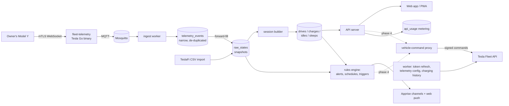

<!-- /autoplan restore point: /Users/jlg/.gstack/projects/jlgreen11-teslai/main-autoplan-restore-20260914-231116.md -->
# teslai: Architecture Proposal (for review, nothing built yet)

**Goal.** A tool that replicates what TeslaFi offers, built first to replace TeslaFi for the owner's own car. Sharing it with other owners, as a hosted service or a self-host kit, is decided only after it has replaced TeslaFi.

**Status.** Draft 4, 2026-09-14, revised by the `/autoplan` review. Scope is now **personal tool first**: teslai replaces TeslaFi for the owner's car before any decision to share it. Phases 0 through 4 can start on the owner's go-ahead. Sharing is a separate, gated decision (section 8).

## Build status (2026-09-15)

| Phase | State | What exists |
|---|---|---|
| 0. Foundations | **Built** | `teslai` CLI (`init`, `doctor`, `errors`), error catalog, private CA and app keys, telemetry and enum config, Postgres 16 + PostGIS (arm64), durable Mosquitto, account-scoped repository, CI (unit, integration with Postgres and Mosquitto, runtime-only imports) |
| 1. Import and core | **Built, not yet run on real data** | DST-safe TeslaFi importer, carry-forward reducer, session builder, `teslai import teslafi`, `teslai gate history` |
| 2. Live and cutover | **Code built; deployment waits on the owner** | MQTT worker with manual acks and payload recording, `teslai replay`, live session rebuild, Tesla OAuth, registration and encrypted tokens, `teslai tesla register/login/charging-history`, `teslai pair`, `teslai telemetry server-config/push/status/remove`, `teslai gate live`, owner login with TOTP, pinned container images, [deployment and cutover runbook](runbooks/deploy.md) |
| 3. Daily parity | **Built** | TeslaFi-style React web app: status bar with car diagram and tire pressures, Today timeline with battery curve, drive, charge and parked lists, drive and charge detail with route maps and time-series charts, month and year calendars, battery health, efficiency by temperature and speed, tire pressure; time-series `samples` table; `teslai demo seed`; totals and CSV export; places; time-of-use charging cost; Supercharger invoice totals; alerts for unlocked away, windows, tire pressure, new software, silent telemetry, billing, certificates and backups; drive and charge summaries; nightly backups with restore checks |
| 4. Full parity | **In progress** | Home Assistant via MQTT discovery; lifetime map. Not built: vehicle controls, schedules and triggers (owner has controls disabled), share links, service log |

**Waiting on the owner:** the TeslaFi full-history CSV and history API token for the real history gate; the server, domain, Tesla developer app and key pairing for live telemetry.

**Verified during the build, not in the original plan:** fleet-telemetry's MQTT payloads have no timestamp (receive time is used); reliable acks only work for vehicle-data records; the command proxy image's entrypoint is the proxy itself; containers must run as the host user to read `secrets/`; `httpx` is a runtime dependency.

**Still unverified:** the `vehicle_location` OAuth scope name, TeslaFi's real CSV and history API column names, and most charging history response fields. Each parser fails loudly with `TSL-IMPORT-SCHEMA` rather than guessing silently.

## Decisions made

| Decision | Choice | Date |
|---|---|---|
| Scope | Full TeslaFi parity, including controls, automations and community features | 2026-09-14 |
| Distribution | **Personal tool first.** Sharing, hosted or self-host kit, is decided after teslai replaces TeslaFi (autoplan premise gate). The code stays public under MIT. | 2026-09-14 |
| Pricing | Not applicable until the sharing decision. Per-car Tesla API usage is metered from day one. | 2026-09-14 |
| Hosting | Oracle Cloud Always Free VM for personal use; paid hosting if sharing proceeds | 2026-09-14 |
| TeslaFi history | Downloaded once the importer exists | 2026-09-14 |
| Build vs. adopt | Build. Existing loggers are single-user tools, not products. | 2026-09-14 |
| Alert channels | Support all TeslaFi channels through one library | 2026-09-14 |
| Stack | Python 3.12 + FastAPI, React + Vite + TypeScript, PostgreSQL 16 + PostGIS | 2026-09-14 |
| License | MIT | 2026-09-14 |
| Legal entity | Owner registers the Tesla developer app personally for self-use; an LLC is formed before the beta | 2026-09-14 |
| Product name | Chosen before the beta. "teslai" stays the internal repo name. | 2026-09-14 |

**Changes from draft 2.**
- Commands, schedules, triggers and community features are back in scope.
- The design is multi-tenant from the first migration, even while the owner is the only user.
- The side-by-side run with TeslaFi is unlikely to work, so cutover is replaced with import-first validation.
- New product-launch requirements are covered: naming, Tesla app registration, legal pages and licensing.

---

## 1. Findings that shape the design

### 1.1 Owner's TeslaFi account (logged-in review, 2026-09-14)

Personal details are deliberately left out of this public document.

| Area | Finding | Consequence |
|---|---|---|
| Connection | TeslaFi streams this car through Fleet Telemetry with 59 fields | Adopt the same field set (section 5) |
| History | 46 months of raw data, Dec 2022 to Sep 2026. About 3,100 drives, 12,400 idles and 8,500 sleeps. Full history is downloadable as one CSV. | Import is the first real test of the session builder |
| Controls | Disabled today, zero commands used | Controls are built for parity, but later in the order |
| Alerts in use | Unlocked away from home, windows open, tire pressure, logging offline, new software, drive and charge email summaries | Early phase |
| Charging | Home time-of-use rates, free public charging, Supercharger sessions on credit miles, gas-savings baseline | Cost model must handle all of these |
| Places | About 60 labeled locations, with no export | One-time scrape during migration |
| TeslaFi price | $7.99/month | Reference point for future pricing |

### 1.2 Tesla platform constraints

| Constraint | Detail | Source |
|---|---|---|
| Owner API | Personal accounts getting 403 since June 2026. Not usable. | [TeslaMate #5399](https://github.com/teslamate-org/teslamate/issues/5399) |
| Fleet API pricing | Signal $0.0001, command $0.001, data request $0.002, wake $0.02. $10/month credit. | [Teslemetry](https://teslemetry.com/blog/tesla-fleet-api-pay-per-use), [Tesla billing](https://developer.tesla.com/docs/fleet-api/billing-and-limits) |
| Tesla's cost example | About $0.36/day per car for about an hour of driving or charging daily | [Not a Tesla App](https://www.notateslaapp.com/news/2415/tesla-announces-api-pricing-third-party-service-costs-expected-to-rise) |
| Public app registration | Requires legal business details, app name, description and purpose. Name must be unique. Registration is repeated per region. Request only the scopes the app needs. Selling personal data is prohibited. | [Tesla: What is Fleet API](https://developer.tesla.com/docs/fleet-api/getting-started/what-is-fleet-api), [Tesla third-party apps](https://www.tesla.com/support/access-third-party-apps) |
| Telemetry configs per car | Up to 3, but a second app configuring telemetry on a car already streaming to another app returns `config: null`. Tesla's bug is open and marked high priority. | [fleet-telemetry #294](https://github.com/teslamotors/fleet-telemetry/issues/294) |
| Trademarks | Tesla's guidelines prohibit using Tesla trademarks as part of a product or service name, or implying endorsement | [Tesla legal resources](https://www.tesla.com/legal/additional-resources) |

### 1.3 Hosting constraint

Oracle halved the Always Free Ampere allowance on 2026-06-15, without announcement, to **2 cores and 12 GB of RAM**, plus 200 GB block storage. Idle free instances can be reclaimed. ([InfoQ](https://www.infoq.com/news/2026/07/oracle-cloud-free-tier-limits/), [Oracle docs](https://docs.oracle.com/en-us/iaas/Content/FreeTier/freetier_topic-Always_Free_Resources.htm)) That is enough for the owner plus a small beta. Oracle can change terms silently, so the whole stack must be portable to a paid host in under an hour.

---

## 2. Tesla API cost

Draft 3 used Tesla's example of about $0.36/day per car, roughly $11/month. **That example includes polling, commands and wakes. It is not the cost of streaming.** Streaming bills per signal, and signals are sent only when a value changes, subject to each field's minimum interval. A parked, sleeping car sends nothing. An independent estimate puts streaming at about $0.0067 per vehicle-hour, under $5/month even if a car streamed around the clock ([Desert Lakes](https://desertlakes.io/tesla-fleet-api-pricing-streaming-vs-polling/)). Tesla's own guidance is that the $10 monthly credit covers streaming plus 100 commands and 2 wakes per day for two vehicles.

**Target: $0/month by staying inside the $10 credit.**
- **Measure, don't assume.** `api_usage` counts signals per field, commands, wakes and data requests per day. A settings page shows the month-to-date and projected bill.
- **Tune intervals per field.** Location and speed update quickly only while driving. Slow-changing fields such as tire pressure, firmware and cabin-overheat settings get long minimum intervals.
- **Never wake the car to log.** Wakes are the most expensive unit and are used only for commands the owner starts.
- **Cap it at Tesla's side.** Set an explicit billing limit in the developer console. Set `minimum_delta` per field. Drop RouteLine and MinutesToArrival from the subscription unless a feature needs them, because they change constantly while driving.
- **Alert before the cap.** Tesla disables an application that exceeds its billing limit, which would silently stop all logging. Alert at 50% and 80% of the credit, and again if the billing limit is ever reached.

## 3. Deployment

One deployment, one owner, one `docker compose` stack. The owner registers their own Tesla developer app under their own domain.

The design keeps the door to sharing open without paying for it now:
- Every table carries `account_id`, so a later multi-user mode is a policy change, not a schema rewrite.
- Row-level security policies, signup, invites, onboarding flows, legal pages and a hosted billing model are **not built** until the sharing decision in section 8.
- Because the owner's own deployment already uses the self-host path, a self-host kit for others is mostly documentation plus a setup wizard.

## 4. System overview



| Component | Choice | Why |
|---|---|---|
| Telemetry receiver | [`teslamotors/fleet-telemetry`](https://github.com/teslamotors/fleet-telemetry) | Tesla-maintained; handles mTLS and decoding. Built for fleets, so it would also serve more cars if sharing proceeds. |
| Command signing | [`teslamotors/vehicle-command`](https://github.com/teslamotors/vehicle-command) HTTP proxy | **Phase 0**, because pushing the telemetry config to the car must be signed through it. Vehicle commands stay disabled by allowlist until phase 4. Holds the app's private key. |
| Message bus | Mosquitto (built-in dispatcher) | Buffers across restarts. Enough for beta scale. NATS or Kafka become options if volume demands. |
| Backend | Python 3.12, FastAPI, SQLAlchemy, Alembic; separate `worker` process for ingest, sessions, rules and scheduled jobs | Owner's working language. Strong data tooling for import, reconciliation and reports. |
| Database | PostgreSQL 16 + PostGIS; every table carries `account_id` (RLS deferred to the sharing gate) | Tenant isolation enforced by the database, not just app code. Real geofences and spatial queries. |
| Frontend | React + Vite + TypeScript, MapLibre GL, ECharts, installable PWA | Mobile-first, with web push. |
| Notifications | [Apprise](https://github.com/caronc/apprise) + web push | Email, Pushover, Telegram, Discord, ntfy and SMS gateways in one library. |
| Email | A transactional email provider's free tier | Summaries, alerts and account email. The provider is chosen at build time. |
| Reverse proxy | Caddy | Automatic certificates, plus serving Tesla's public-key URL. |
| Packaging | `docker compose`, one file for both modes | Same artifact for Oracle, a paid host, or a self-hoster's box. |
| CLI | `teslai` (Typer), shipped in the app image | Every setup, import, gate, cutover and recovery step is a command with `--dry-run`, not prose. |

---

## 5. Data model

**Tenancy-ready, single account.** `accounts` → `users` → `vehicles`, and every row carries `account_id`. Only one account exists. Row-level security policies are deferred to the sharing decision, but every query goes through one repository layer that filters by `account_id`, so enabling RLS later does not touch feature code.

**One pipeline for history and live data, with a normalization step.** The two sources have different shapes. A TeslaFi CSV row is a full snapshot of every field at a sample time. A telemetry message carries only the fields that changed. Feeding both straight into one wide table would make the builder see "missing" values on every telemetry row.

- `telemetry_events` — narrow, append-only: `(vehicle_id, ts, field, value, source, received_at)`. Live messages land here unchanged, de-duplicated on `(vehicle_id, ts, field)` because MQTT delivers at least once.
- `raw_states` — wide snapshots produced by forward-filling `telemetry_events` to a regular grid while awake, plus TeslaFi CSV rows loaded directly. Each row records which fields were carried forward and how old they are.
- **Two kinds of fields, two carry-forward rules.** Telemetry sends a field only when it changes, so a 40-minute drive may deliver `Gear=D` exactly once. **State fields** (enums and flags such as Gear, Locked, ChargePort, DetailedChargeState, SentryMode) carry forward with no age limit and are cleared only by a connectivity event or a session boundary. **Continuous fields** (speed, power, location) carry forward only within a short per-field limit, then become unknown.
- `connectivity_events` — fleet-telemetry connectivity records (vehicle connected or disconnected), stored as their own stream. Sleep versus "unreachable" is decided from these events plus the server's own uptime log, never from silence alone. A parked car that is awake with Sentry or climate on can send almost nothing for long stretches.
- **Enum mapping table.** A versioned table maps every value of Gear, DetailedChargeState, ChargingCableType and similar enums to a builder meaning, including `Invalid`, SNA and null. For example, `ShiftStateInvalid` around parking does not start a drive, and ChargingCableType `Invalid` means no cable. DetailedChargeState exists only on firmware 2024.38 and later; older history falls back to charging state.
- **Session boundaries.** A drive starts only after a non-P, non-Invalid gear persists past a short debounce and position changes. A charge session ends at Complete or Stopped. A reset of the `ACChargingEnergyIn` or `DCChargingEnergyIn` counter always opens a new charge, so top-ups after Complete do not stretch the previous one.
- **Vehicle time and late data.** Sessions are built on the vehicle's timestamp where one is available. **Build finding (2026-09-15):** fleet-telemetry's MQTT dispatcher publishes each field as a bare JSON value on `<topic_base>/<VIN>/v/<field>` with no timestamp; only connectivity records carry `CreatedAt`. Live field events are therefore stamped with the worker's receive time, which is close to vehicle time while the stream is healthy but not after a backlog. If receive-time skew shows up in the live gate, switch to a dispatcher whose records keep the vehicle's `CreatedAt` (ZMQ or Kafka JSON), which the ingest layer is isolated enough to swap. Events arriving behind a watermark trigger re-derivation of a sliding window around them. Alerts fire from one normalized state stream, not from both `raw_states` and sessions, and are de-duplicated through `rule_firings` so a replay cannot re-send "drive started".
- **Recorded replay from day one.** Every raw MQTT payload is also written to compressed daily files kept outside the repo. A replay harness pushes these through the live path, because the TeslaFi CSV import skips `telemetry_events` and forward-fill and so cannot test them.
- `telemetry_events` is partitioned by month. Partitions older than 12 months are exported to object storage as Parquet and dropped, after their `raw_states` are derived and backed up.

This keeps the promise that history and live data are computed identically, while making the difference in source shape explicit and testable.

**Core tables**
- `accounts`, `users`, `sessions`, `audit_log`. Memberships and invites are added at the sharing gate.
- `tesla_connections` — encrypted OAuth tokens, scopes, region, virtual key status, telemetry config status.
- `vehicles` — VIN, name, model, trim, hardware, firmware history.
- `raw_states` — `(vehicle_id, ts)` key, typed nullable columns for the telemetry fields, `source`. Partitioned by month.
- `drives`, `charges`, `idles`, `sleeps` — derived sessions with cached aggregates and `builder_version`; `hidden` and `manual` flags.
- `places` — PostGIS geometry, name, icon, tariff, `free_charging`; `auto_tag_rules`.
- `tariffs`, `gas_baselines`, `supercharger_sessions` — invoices, fees, credits, currency.
- `rules` (alerts), `schedules`, `triggers`, `climate_presets`, `rule_firings`, `commands_log`.
- `notification_channels`, `email_summaries`.
- `service_reminders`, `service_log`, `attachments`.
- `trips`, `share_links`, `location_shares`.
- `api_tokens` — the user-facing JSON API.
- `api_usage` — per-vehicle daily signal, command, wake and data-request counts, with estimated cost.

**Telemetry field set**, adopted from TeslaFi's subscription: ACChargingEnergyIn, ACChargingPower, BatteryHeaterOn, BatteryLevel, CabinOverheatProtectionMode, ChargeAmps, ChargeCurrentRequest, ChargeLimitSoc, ChargePort, ChargePortColdWeatherMode, ChargeRateMilePerHour, ChargerPhases, ChargerVoltage, ChargingCableType, DCChargingEnergyIn, DCChargingPower, DefrostMode, DestinationName, DetailedChargeState, DoorState, EnergyRemaining, EstBatteryRange, EuropeVehicle, FastChargerPresent, FastChargerType, FdWindow, FpWindow, Gear, HvacFanStatus, HvacLeftTemperatureRequest, HvacPower, IdealBatteryRange, InsideTemp, LifetimeEnergyUsed, Location, Locked, MilesSinceReset, MinutesToArrival, Odometer, OutsideTemp, PackCurrent, PackVoltage, RatedRange, RdWindow, RightHandDrive, RouteLine, RpWindow, ScheduledChargingStartTime, SelfDrivingMilesSinceReset, SentryMode, SoftwareUpdateVersion, TpmsPressureFl, TpmsPressureFr, TpmsPressureRl, TpmsPressureRr, VehicleName, VehicleSpeed, Version, WheelType.

**Session builder.** A deterministic, idempotent state machine:
- A drive starts when gear leaves P, or speed exceeds 0 where gear is missing. It ends after P plus a dwell time, or after N minutes offline.
- A charge follows charging state and cable presence.
- Sleep is a telemetry gap beyond a threshold. Idle is the remainder, with conditioning loss attributed from HVAC state.
- Thresholds are per-account settings. Changing them bumps `builder_version` and re-derives.

**Community data rules.** Opt-in per user. Only aggregates are published, and no statistic is shown for groups smaller than a minimum count. Leaderboards use display names chosen by the user.

---


### Operator CLI and configuration

Every runbook in this plan is a command. The web wizard, if built, only calls these.

| Command | Does |
|---|---|
| `teslai init` | Generates `.env`, private CA, app key pair; validates domain and DNS |
| `teslai tesla register` | Registers the developer app and makes the partner-account registration call for the region |
| `teslai pair` | Prints the virtual-key QR code in the terminal and waits until the key is paired |
| `teslai telemetry push / status / diff` | Pushes `telemetry.yaml` as a signed config, reads back `synced` and `exp`, diffs against the car |
| `teslai doctor` | Runs every check in order (domain, public key URL, partner registration, token, scopes, key paired, config synced, cert chain, broker, last message age) and prints the first failure with its fix |
| `teslai import teslafi --tz <IANA> --switch-date auto --dry-run` | Imports history; the timezone flag is required and validated; writes a per-month report |
| `teslai rebuild --since <date>` | Re-derives sessions with the current `builder_version` |
| `teslai gate history / live` | Prints pass/fail tables and writes report files |
| `teslai cutover --dry-run` / `teslai rollback` | Scripted cutover and rollback with config read-back |
| `teslai replay <day>` | Pushes recorded payloads through the live path |
| `teslai restore --to <db>` | Restores a backup and checks row counts |
| `teslai upgrade` | Pulls the pinned image, backs up, migrates, rebuilds if `builder_version` changed |

**Configuration as files, round-trippable.** `telemetry.yaml` (field, interval, `minimum_delta`), `enums.yaml` (owner overrides layered on the shipped mapping table), `rules.yaml`, `tariffs.yaml` and `places.csv` are loaded on start and exportable from the UI. The database is never the only copy of owner configuration. Before any `telemetry push`, the CLI shows the projected monthly signal cost.

**Error catalog.** Every Tesla-side and system failure has a stable code, for example `TSL-KEY-UNPAIRED`, `TSL-PARTNER-UNREGISTERED`, `TSL-SCOPE-MISSING`, `TSL-BILLING-DISABLED`, `TSL-CONFIG-NULL`, `TSL-CA-MISMATCH`, `TSL-FIRMWARE-TOO-OLD`, `TSL-VIN-REJECTED`, `TSL-REGION-WRONG` and `TSL-TOKEN-CONSUMED`. Each entry gives the problem, the likely cause, the exact fixing command and a docs anchor. `doctor`, alerts, logs and API errors all use the same codes.

**Data access.** A read-only Postgres role and stable views (`v_drives`, `v_charges`, `v_idles`, `v_sleeps`, `v_raw_states`) hide `account_id` and partitioning, for SQL, notebooks and Grafana. Parquet exports are a first-class output. The JSON API is versioned at `/api/v1` with the FastAPI OpenAPI spec published, plural resources, and scoped tokens (`read:sessions`, `read:location`, `command:*`).

**Docs, in order of need.** README quickstart with expected output after each step. Per-step how-tos: Tesla registration, pairing, import, cutover. The error catalog. Reference: CLI, config schema, API. Upgrade notes per release. A CI job follows the quickstart literally against a mock Tesla API.

## 6. Full TeslaFi parity map

Built from TeslaFi's complete menu as seen in the owner's account. Phases are defined in section 8.

| TeslaFi area | Features | Phase |
|---|---|---|
| **Logging core** | Drive, charge, idle and sleep logs; day view with battery chart and map; compact and filtered views | 1 |
| **Import** | TeslaFi full-history CSV import, reconciliation report, places, tariffs and gas-baseline migration | 1 |
| **Drives** | Drive summary, temperature efficiency, speed efficiency, search and CSV download, add or edit drive, hidden drives, odometer graph, FSD miles | 2 |
| **Places** | Labeled locations, label a location, unlabeled locations, auto-tag drives | 2 |
| **Charges** | Charge summary by location, search and CSV download, add charge, home TOU pricing, free locations, gas savings | 2 |
| **Battery** | Degradation report with trendline and custom starting range | 2 |
| **Parked** | Idle and sleep search and download, vampire drain, conditioning loss, Sentry time | 2 |
| **Calendar** | Year and month views with totals | 2 |
| **Tires** | Tire pressure graph and history | 2 |
| **Alerts** | Unlocked, windows, tire pressure, drive started, charge complete, logging offline, new software, Sentry events, plug-in and charge-limit reminders | 2 |
| **Channels** | Email, SMS via gateway or paid provider, Pushover, Telegram, Discord, ntfy, web push; email summaries | 2 |
| **Supercharging** | Invoice download from Fleet API charging history, matching to charges, credits and idle fees | 3 |
| **Controls** | Live controls: lock, climate, defrost, seat and wheel heat, charge start, stop, limit and amps, Sentry, valet, flash, honk | 3 |
| **Automation** | Schedules with do-not-wake option, triggers on arrival, climate presets, auto-Sentry | 3 |
| **API** | Personal API tokens, last-data JSON, drives and charges history JSON, commands with per-command enablement and wake option | 3 |
| **Accounts** | Multi-user signup, invites, Tesla OAuth onboarding, QR virtual-key install, two-factor or passkeys, login alerts, data export, account deletion | Sharing gate |
| **Self-host** | Setup wizard, self-host documentation, upgrade path | 4 |
| **Maps and sharing** | Lifetime map, driveprint cell coverage, road trips, shared drives and trips, time-limited location sharing | 4 |
| **Service** | Service reminders by date or odometer, service log with cost and photos, image uploads | 4 |
| **Community** (hosted) | Software tracker, your software updates, latest software comparison, leaderboards, statistics map, Supercharger statistics, fleet battery-degradation average | Sharing gate |
| **Integrations** | Home Assistant via MQTT, Alexa skill, Tesla orders status, auto-label destinations from navigation | 4 |
| **Business** | Pricing, payments, referral credits, public launch | Sharing gate |

Sleep Modes is intentionally not replicated: with Fleet Telemetry the car sleeps on its own, and TeslaFi's own account page says so.

---

## 7. TeslaFi migration and cutover

1. **Build the importer before touching the car.** Download the full-history CSV. Pull the drives and charges answer key from TeslaFi's history API with a TeslaFi API token. Scrape places, tariffs and gas baseline once. Everything goes in git-ignored paths.
2. **History gate.** Import timestamps are local time with no offset. Convert to UTC in file order using an explicit IANA zone. At the DST fall-back hour, pick the side that keeps the sequence increasing. Fail loudly on missing columns or a change of units. The data covers 8 DST transitions, and each gets a test. TeslaFi itself moved from polling to streaming partway through the 46 months, so the gate is evaluated separately before and after that switch date. Derived sessions must match TeslaFi per month within 1% on drive count, miles, kWh used, charge count, kWh added and cost, with every mismatch listed. Totals are also checked against odometer and energy deltas, so the gate does not reward copying TeslaFi's own errors. This proves the builder reproduces TeslaFi's view of history. It does **not** prove live correctness, because TeslaFi rows are snapshots and live telemetry is change events.
3. **Try parallel streaming.** Tesla's open bug ([fleet-telemetry #294](https://github.com/teslamotors/fleet-telemetry/issues/294)) suggests a second app cannot configure telemetry on a car already streaming to another app. One attempt costs nothing. If it works, run both for 2–4 weeks and skip step 5's risk.
4. **Write and rehearse the rollback runbook first.** It is a script against the Fleet API, not a manual click-through of TeslaFi's page. It removes teslai's telemetry config and re-enables TeslaFi's, reading `fleet_telemetry_config` back before and after each step. The virtual key must already be paired, and a failed parallel attempt can leave a `config: null` state the script must detect. Keep TeslaFi subscribed until step 6 passes.
5. **Cut over.** Remove TeslaFi's telemetry config and configure teslai's.
6. **Live gate, 2–4 weeks.** Every drive's distance matches the odometer delta within 0.5%. Every charge's kWh added reconciles with the battery energy change, and Supercharger sessions with Tesla's charging history. There are no gaps longer than the car's sleep periods. The owner spot-checks a week of days against the car's own trip meter. Any unexplained gap or mismatch fails the gate and triggers the rollback runbook.
7. **Close out.** Re-import TeslaFi data for the cutover window if it streamed in parallel, then cancel TeslaFi.

## 8. Build phases

| Phase | Outcome | Needs the owner |
|---|---|---|
| 0. Foundations | Repo scaffold, compose stack, schema with `account_id`, CI, `.env` handling, synthetic fixtures, enum mapping table, `teslai` CLI skeleton with `init`, `doctor`, error catalog, README quickstart, vehicle-command proxy for signing config pushes. **Hello path:** a throwaway telemetry endpoint proves registration, pairing, private CA and config push end to end. Spikes: car buffering after an outage, token rotation. | Tesla developer app and pairing for the hello path |
| 1. Import and core | TeslaFi importer, normalization, session builder, history gate passing on 46 months, day view | Download CSV, generate TeslaFi API token |
| 2. Live and cutover | Oracle VM, domain, owner login, telemetry live with payload recording, cost meter and alerts, scripted rollback, cutover, live gate passing, TeslaFi cancelled | Oracle and Tesla accounts, domain, QR scan in the Tesla app |
| 3. Daily parity | Drives, places, charges and costs, battery report, parked, calendar, tires, alerts and summaries | No |
| 4. Full parity for the owner | Controls and automation for the owner's own car, Supercharger invoices, personal API, maps and share links, service log, Home Assistant | No |
| Sharing gate | A decision, not a build phase. Proceed only if: the owner has run teslai alone for 60+ days, measured per-car API cost fits a price people pay today ($4–8/month), and at least 20 owners commit to a beta. If yes: product name without "Tesla", LLC, RLS policies, signup and invites, legal pages, paid hosting, community features. If no: publish the self-host docs and stop. | Owner decision |

TeslaFi is cancelled at the end of phase 2, and only after the live gate passes.

## 9. Hosting and operations

| Stage | Host | Notes |
|---|---|---|
| Personal use | Oracle Always Free, 2 cores and 12 GB, plus about $10/yr domain | Enough for one car. Continuous telemetry traffic keeps the instance from looking idle. |
| If sharing proceeds | Paid VPS or managed Postgres | Other people's location data should not sit on a free tier the provider can reclaim or shrink without notice. |

- **Reachability.** The car needs end-to-end mTLS on a public hostname. TLS-terminating tunnels cannot sit in front of the telemetry server.
- **Outage behavior is unverified.** Whether the car buffers and resends telemetry after the server was unreachable is not documented. Test it in phase 0 against a throwaway telemetry endpoint, not during cutover. Until verified, plan as if outages lose data.
- **Point-in-time recovery.** WAL archiving to object storage in addition to nightly dumps, because the VM is a single disk. Uptime is monitored from outside the VM.
- **Certificates and telemetry config.** The config pushed to the car embeds the server's CA chain and its own expiry, and is signed through vehicle-command. A public-CA renewal that changes intermediates can silently break the car's connection until the config is re-pushed. So the telemetry server uses a **private CA with a long-lived server certificate** pinned in the config's `ca` field. Caddy's public certificate is used only for the web UI and the public-key URL. Monitor config `exp` and `synced`, and make re-pushing the config an automated, tested job. The domain hosting the public key is critical infrastructure: losing it lets someone else impersonate the app, so it gets auto-renew and an expiry alert.
- **Tesla token rotation.** Refresh tokens are single-use and rotate on every refresh. Exactly one process refreshes, holding a row lock on the token row, and the new token is saved in the same transaction. A heartbeat alert fires if the token grows older than expected.
- **Mosquitto durability is configured, not assumed.** Broker `persistence true`, QoS 1, a fixed worker client ID with `clean_session=false`, and fleet-telemetry's `reliable_ack` on the MQTT dispatcher. Tested by killing the worker and restarting the broker mid-drive in a replay.
- **Backups.** Nightly encrypted `pg_dump` to Cloudflare R2 or Backblaze B2 free tier, plus a copy to the Mac Mini. A scheduled job restores the latest dump into a scratch database weekly and checks row counts.
- **Portability.** A restore-to-new-host runbook, rehearsed once in phase 2.
- **Monitoring.** Alerts on: no telemetry for longer than the car's longest normal sleep while it reports awake in the Tesla app, token refresh failure, telemetry config unsynced, certificate expiry, Tesla billing at 50% and 80%, backup failure, builder errors.

## 10. Security and privacy

- One repository layer filters every query by `account_id`. Row-level security policies and cross-account tests are added at the sharing gate.
- Tesla tokens encrypted at rest with envelope encryption. The command-signing key lives only in the proxy container, which sits on an internal-only Docker network the web tier cannot reach directly.
- **Owner login ships in phase 2**, before the PWA exposes live location: passkey or TOTP, rate-limited.
- Commands go through a per-command allowlist. Unlock, valet mode and remote start require step-up re-authentication.
- The telemetry server rejects VINs that are not in `vehicles`, since any Tesla-signed client certificate can connect.
- Apprise notification URLs contain tokens and are stored as secrets.
- Passkeys or TOTP, login alerts, and rate limiting on auth and commands.
- Minimal Tesla scopes, requested per feature, as Tesla's terms require.
- User data export and full account deletion, including raw location history.
- No selling or sharing of personal data. Community aggregates are opt-in and thresholded.
- Privacy policy and terms of service before the first non-owner user.
- The repo is public. Secrets, exports, scraped personal data and `.env` files are git-ignored.

---

## 11. Open-source licensing

**MIT, chosen 2026-09-14.** It allows maximum adoption, including closed commercial forks of the code. The hosted service's advantages are therefore operational, not legal: community data, a registered Tesla app, onboarding, and reliability.

---

## 12. Remaining decisions

None block phases 0–4. These apply only if the sharing gate in section 8 passes:
1. **Product name.** A public name without "Tesla" in it, per Tesla's trademark guidelines.
2. **Domain** for the shared service.
3. **LLC formation** before registering a public Tesla app.

## Sources

- [TeslaFi](https://www.teslafi.com/), plus the owner's logged-in account pages
- [Tesla Fleet API](https://developer.tesla.com/docs/fleet-api), [What is Fleet API](https://developer.tesla.com/docs/fleet-api/getting-started/what-is-fleet-api), [billing and limits](https://developer.tesla.com/docs/fleet-api/billing-and-limits), [announcements](https://developer.tesla.com/docs/fleet-api/announcements), [telemetry fields](https://developer.tesla.com/docs/fleet-api/fleet-telemetry/available-data), [FAQ](https://developer.tesla.com/docs/fleet-api/support/faq)
- [Tesla: Managing access with third-party apps](https://www.tesla.com/support/access-third-party-apps), [Tesla legal resources](https://www.tesla.com/legal/additional-resources)
- [Teslemetry pricing summary](https://teslemetry.com/blog/tesla-fleet-api-pay-per-use), [Not a Tesla App on API pricing](https://www.notateslaapp.com/news/2415/tesla-announces-api-pricing-third-party-service-costs-expected-to-rise)
- [teslamotors/fleet-telemetry](https://github.com/teslamotors/fleet-telemetry), [issue #294](https://github.com/teslamotors/fleet-telemetry/issues/294)
- [TeslaMate API docs](https://docs.teslamate.org/docs/configuration/api/), [TeslaFi import](https://docs.teslamate.org/docs/import/teslafi/), [issue #5399](https://github.com/teslamate-org/teslamate/issues/5399)
- [TeslaLogger](https://github.com/bassmaster187/TeslaLogger), [teslog-web](https://github.com/steveneppler/teslog-web)
- [Oracle Always Free resources](https://docs.oracle.com/en-us/iaas/Content/FreeTier/freetier_topic-Always_Free_Resources.htm), [InfoQ on the June 2026 cut](https://www.infoq.com/news/2026/07/oracle-cloud-free-tier-limits/)

## Autoplan Review: CEO phase (2026-09-14)

Mode: SELECTIVE EXPANSION. Outside voices: Claude subagent only; Codex is not installed. Tag: `[subagent-only]`.

### Step 0

**0A. Premises.**

| # | Premise | Finding | Outcome |
|---|---|---|---|
| 1 | Owner needs TeslaFi-level logging and wants to stop paying $7.99/month | Valid; it is the stated goal | Kept |
| 2 | Full TeslaFi parity is the right target | Valid for the owner's own use. Community features need hundreds of cars and are meaningless for one. | Kept for owner-facing features; community features moved behind the sharing gate |
| 3 | A hosted service is viable | Unproven. Competitors charge $4–8/month, Teslascope has a free tier, and demand from other owners is untested. | **Owner chose: personal tool first** |
| 4 | Building beats adopting | Contested. MyTeslaMate hosts TeslaMate for €4.99, and TeslaMate supports Fleet Telemetry plus a TeslaFi importer. | Build kept as owner's direction; adoption spike raised as a user challenge |
| 5 | Side-by-side run with TeslaFi will not work | Likely true per fleet-telemetry #294 | Kept; rollback runbook and live gate added |
| 6 | Self-hosters will register their own Tesla app | High friction for non-technical owners | Moot until the sharing gate |

**0B. Existing leverage.** The repo has no code. Reusable external pieces: Tesla's `fleet-telemetry` and `vehicle-command` servers, TeslaMate's TeslaFi importer as an edge-case reference, TeslaFi's history API as the reconciliation answer key, Apprise, Nominatim and H3.

**0C. Dream state.**
```
  CURRENT                         THIS PLAN                          12-MONTH IDEAL
  TeslaFi $7.99/mo, 46 months     Owner's car streams to own stack,  Owner's history fully owned and
  of history locked in a SaaS,    history imported and reconciled,   validated; analytics TeslaFi lacks
  controls unused                 TeslaFi cancelled after live gate  (degradation CIs, TOU optimizer);
                                                                     sharing decided with real cost data
```

**0C-bis. Approaches.**
```
APPROACH A: Build personal logger (chosen by owner)
  Effort: L   Risk: Med
  Pros: fits owner's exact use; one pipeline for history and live data; analytics layer is native
  Cons: most hours; new session builder must earn trust before TeslaFi is cancelled
  Reuses: Tesla's telemetry and command servers, Apprise, TeslaMate importer as reference

APPROACH B: Adopt TeslaMate with self-hosted telemetry, build only analytics on its Postgres
  Effort: S-M  Risk: Low-Med
  Pros: weeks not months to cancel TeslaFi; mature importer and dashboards
  Cons: Elixir codebase; Grafana UI, not an app; owner's reconciliation and cost model bolted on
  Reuses: TeslaMate end to end

APPROACH C: Hybrid, adopt TeslaMate for ingestion now, migrate to Approach A later
  Effort: M   Risk: Med
  Pros: TeslaFi cancelled fast; own builder developed against TeslaMate's data
  Cons: two schemas to reconcile; migration work twice
```
Recommendation: A, because the owner has twice chosen to build. B is surfaced at the final gate as a user challenge.

**0D. Selective expansion.** The complexity check triggers: seven containers and more than two new services. For personal use the minimum stack is telemetry server, Mosquitto, Postgres, app plus worker, and Caddy. The command proxy is deferred to phase 4.

Candidates:
- Analytics differentiators: deferred to TODOS (taste).
- TeslaMate adoption spike: user challenge.
- Weekly restore test: accepted.
- Streaming cost meter: accepted.
- Standalone TeslaFi export-and-validate tool: deferred.

**0E. Temporal interrogation.**
- **Hour 1.** Exact TeslaFi CSV columns and timezone handling. Resolve by inspecting the real export locally, never committing it.
- **Hours 2–3.** Drive start and end thresholds, and staleness limits per field. Resolve by tuning against the TeslaFi answer key.
- **Hours 4–5.** Telemetry certificate chain and the `fleet_telemetry_config` CA field. Car buffering behavior after an outage.
- **Hour 6+.** Fixtures without personal data. Timezone and DST edges in the history gate.

**0F. Mode:** SELECTIVE EXPANSION.

### Outside voice consensus

```
CEO DUAL VOICES — CONSENSUS TABLE:
═══════════════════════════════════════════════════════════════
  Dimension                           Claude  Codex  Consensus
  ──────────────────────────────────── ─────── ─────── ─────────
  1. Premises valid?                   No      N/A    resolved by owner (personal-first)
  2. Right problem to solve?           Partly  N/A    analytics edge noted (deferred)
  3. Scope calibration correct?        No      N/A    resolved by owner (sharing gate)
  4. Alternatives sufficiently explored?No     N/A    USER CHALLENGE (adopt spike)
  5. Competitive/market risks covered? No      N/A    now in sharing gate criteria
  6. 6-month trajectory sound?         No      N/A    live gate + rollback added
═══════════════════════════════════════════════════════════════
Codex unavailable, so no dimension is CONFIRMED.
```

### Review sections

**1. Architecture.**
```
 Model Y ──mTLS──▶ fleet-telemetry ──MQTT──▶ Mosquitto ──▶ worker: ingest ──▶ telemetry_events
                                                                  │                 │ forward-fill
 TeslaFi CSV ──────────────────────────────▶ importer ────────────┼──────────▶ raw_states
                                                                  ▼                 │
                                                          alerts ◀── session builder ──▶ drives/charges/idles/sleeps
                                                             │                              │
                                                          Apprise                      API ──▶ PWA
 Tesla Fleet API ◀── token refresh, telemetry config, charging history ── worker        (phase 4: command proxy)
```
- Single points of failure: the VM, Postgres and the telemetry certificate. Mitigated by backups, a restore runbook and certificate alerts.
- Outage buffering by the car is undocumented, so a test was added.
- Rollback: pinned image tags, `pg_dump` before every migration, and down-migrations.

**2. Error and rescue map.** See the registry below. Three silent total-outage paths had no rescue: Tesla billing-limit disablement, refresh-token failure and telemetry certificate expiry. All three now alert.

**3. Security.**

| Threat | Likelihood | Impact | Mitigation |
|---|---|---|---|
| Real TeslaFi exports or fixtures committed to the public repo | Med | High | Synthetic fixtures only; gitignore plus a pre-commit scan |
| Tesla tokens leaked | Low | High | Encrypted at rest, `.env` never committed |
| Telemetry port abused | Low | Med | mTLS rejects clients without a Tesla-signed certificate |
| Owner web UI exposed | Med | High | Passkey or TOTP, rate-limited login |
| Unpinned container images | Med | Med | Pin image digests |

**4. Data flow and edge cases.** Main finding: telemetry sends only changed fields, while TeslaFi rows are full snapshots. Fixed with a normalization layer.

| Edge case | Handling |
|---|---|
| Duplicate MQTT delivery | De-duplicated on `(vehicle_id, ts, field)` |
| Out-of-order messages | Ordered by the vehicle timestamp, not arrival time |
| Stale field | Treated as unknown after its per-field limit |
| TeslaFi DST transitions | Converted with the IANA zone, with ambiguous hours logged |
| Importer bad row | Skipped, counted, listed in the report |

**5. Code quality.** One builder serves both sources, so logic is not duplicated. RLS and invites were over-engineering for one user and are deferred. The name `raw_states` is ambiguous next to `telemetry_events`; both are documented in section 5.

**6. Tests.** The history gate alone was insufficient, so the live gate was added. Builder golden tests use synthetic fixtures and property tests check idempotency. A replay test runs recorded telemetry from the owner's car, kept locally. The full test plan comes from the engineering phase.

**7. Performance.** 46 months of history is at most tens of millions of rows. Load with `COPY` in monthly batches, index `(vehicle_id, ts)` and partition by month. The builder runs incrementally on live data and in full only when `builder_version` changes. 12 GB RAM is ample.

**8. Observability.** Alerts on ingest silence, token refresh, certificate expiry, unsynced config, billing thresholds, backup failure and builder errors. Structured logs carry `vehicle_id` and `session_id`. A reconciliation dashboard shows history-gate and live-gate results.

**9. Deployment.** Compose with pinned digests, and `pg_dump` before migrating. Cutover follows a rehearsed rollback runbook. Post-deploy checks: telemetry message received within 10 minutes of the car waking, and the worker reports healthy.

**10. Trajectory.** Reversibility of building is 4/5: data stays portable and TeslaFi can be kept until the live gate passes. Cutover is 2/5 without the runbook and 4/5 with it. Debt risk: personal data leaking into the public repo through fixtures or screenshots.

**11. Design.** Skipped: no UI scope was detected by the pipeline's rule. The plan names screens but specifies none of them. Run `/plan-design-review` before building phase 1's day view.

### Error and rescue registry

| Codepath | What can go wrong | Rescued? | Rescue action | User sees |
|---|---|---|---|---|
| Telemetry ingest | mTLS handshake fails | Y | Logged by telemetry server | Ingest-silence alert |
| Telemetry ingest | Server certificate expires | **Was N** | Renewal job and 14-day alert | Alert |
| Token refresh | Refresh token rejected | **Was N** | Alert, re-auth link | Alert with fix steps |
| Fleet API | Billing limit reached, app disabled | **Was N** | 50%, 80% and cap alerts | Alert |
| Fleet API | 429 rate limit | Y | Backoff and retry | Nothing |
| MQTT | Broker restart | Y | Reconnect, QoS 1 redelivery | Nothing |
| Normalizer | Unknown field name from new firmware | Y | Stored as untyped event, warning logged | Settings banner |
| Importer | Unparseable row | Y | Skip, count, report | Import report |
| Builder | Impossible transition | Y | Close session, flag for review | Flagged session |
| Geocoder | Rate limit or outage | Y | Queue and retry | Address "pending" |
| Notifications | Channel send fails | Y | Retry, then email fallback | Fallback email |
| Backups | Upload fails | Y | Retry, then alert | Alert |

### Failure modes registry

| Codepath | Failure mode | Rescued? | Test? | User sees? | Logged? |
|---|---|---|---|---|---|
| Telemetry cert | Expiry stops streaming | Y (now) | Planned | Alert | Y |
| Token refresh | Silent auth loss | Y (now) | Planned | Alert | Y |
| Billing cap | App disabled by Tesla | Y (now) | Planned | Alert | Y |
| Builder | Stale gear extends a drive | Y (staleness limit) | Planned | Correct drive | Y |
| Cutover | Gap in history | Y (live gate + rollback) | Rehearsal | Gate failure | Y |

No critical gaps remain after the accepted fixes.

### NOT in scope
- Signup, invites, RLS policies, legal pages, LLC and a public product name, all behind the sharing gate.
- Community features (software tracker, leaderboards, fleet statistics), which need many cars.
- Analytics differentiators (degradation confidence intervals, TOU optimizer, drain anomalies), deferred to TODOS.
- Standalone TeslaFi export-and-validate tool, deferred to TODOS.
- Alexa skill, deferred to phase 4 or later.

### What already exists
- Tesla `fleet-telemetry`: reused unmodified.
- Tesla `vehicle-command` proxy: reused in phase 4.
- TeslaMate TeslaFi importer: read as a reference for edge cases, not copied.
- TeslaFi history API: reused as the answer key.
- Apprise, Nominatim, H3, Caddy: reused.

### Dream state delta
After phase 2 the owner owns and has validated their full history, and TeslaFi is cancelled. Still missing against the 12-month ideal: the analytics that would make teslai better than TeslaFi, and a sharing decision based on measured cost and real demand.

### CEO completion summary
```
  +====================================================================+
  |            MEGA PLAN REVIEW — COMPLETION SUMMARY                   |
  +====================================================================+
  | Mode selected        | SELECTIVE EXPANSION                         |
  | System Audit         | empty repo, 4 doc commits, no TODOs          |
  | Step 0               | premise: personal tool first (owner)        |
  | Section 1  (Arch)    | 2 issues found                              |
  | Section 2  (Errors)  | 12 error paths mapped, 3 GAPS (fixed)       |
  | Section 3  (Security)| 5 issues found, 2 High impact               |
  | Section 4  (Data/UX) | 5 edge cases mapped, 1 structural gap fixed |
  | Section 5  (Quality) | 1 issue found                               |
  | Section 6  (Tests)   | 1 gap (live gate) fixed                     |
  | Section 7  (Perf)    | 0 issues found                              |
  | Section 8  (Observ)  | 3 gaps found (alerts added)                 |
  | Section 9  (Deploy)  | 1 risk flagged (cutover)                    |
  | Section 10 (Future)  | Reversibility: 4/5, debt items: 1           |
  | Section 11 (Design)  | SKIPPED (no UI scope)                       |
  +--------------------------------------------------------------------+
  | NOT in scope         | written (5 items)                           |
  | What already exists  | written                                     |
  | Dream state delta    | written                                     |
  | Error/rescue registry| 12 paths, 0 CRITICAL GAPS remaining         |
  | Failure modes        | 5 total, 0 CRITICAL GAPS remaining          |
  | TODOS.md updates     | 3 items proposed                            |
  | Scope proposals      | 8 proposed, 5 accepted                      |
  | CEO plan             | written                                     |
  | Outside voice        | ran (claude subagent)                       |
  | Lake Score           | 6/7 recommendations chose complete option   |
  | Diagrams produced    | 2 (architecture, dream state)               |
  | Stale diagrams found | 1 (section 4 mermaid; fixed)                 |
  | Unresolved decisions | 0                                           |
  +====================================================================+
```

## Autoplan Review: Engineering phase (2026-09-14)

Outside voices: Claude subagent only (Codex not installed). Tag: `[subagent-only]`.

### Step 0: Scope challenge
- **Existing solutions.** Tesla's telemetry and command servers are reused. TeslaMate's importer is a reference only. The session builder, normalization and reconciliation are new, because nothing existing reconciles against TeslaFi.
- **Minimum change.** Phases 0–2 are the minimum that replaces TeslaFi. Phases 3–4 are the owner's parity goal.
- **Complexity check.** It triggers: seven containers and more than two services. Autoplan never reduces scope at this step. The command proxy is already deferred to phase 4, which leaves five services for phases 0–2.
- **Distribution.** A container image built by CI and published to GHCR, pinned by digest in compose. It isn't in the plan yet, so it is added as a task.

### Outside voice consensus
```
ENG DUAL VOICES — CONSENSUS TABLE:
═══════════════════════════════════════════════════════════════
  Dimension                           Claude  Codex  Consensus
  ──────────────────────────────────── ─────── ─────── ─────────
  1. Architecture sound?               Partly  N/A    session model redesigned
  2. Test coverage sufficient?         No      N/A    replay harness + fixtures added
  3. Performance risks addressed?      Mostly  N/A    event partitioning added
  4. Security threats covered?         No      N/A    command path + auth hardened
  5. Error paths handled?              No      N/A    token, cert, broker paths added
  6. Deployment risk manageable?       Partly  N/A    scripted rollback, PITR added
═══════════════════════════════════════════════════════════════
Codex unavailable, so no dimension is CONFIRMED.
```

### 1. Architecture
```
                    ┌──────────────── Oracle VM (docker compose) ─────────────────┐
 Model Y ──mTLS────▶│ fleet-telemetry ──MQTT(QoS1, persist)──▶ Mosquitto            │
 (private-CA cert)  │        │ connectivity records                  │             │
                    │        ▼                                       ▼             │
                    │  payload recorder ──▶ daily files      worker: ingest        │
                    │                                          │   │               │
                    │                     telemetry_events ◀───┘   └─▶ connectivity_events
                    │                          │ forward-fill (state vs continuous)  │
 TeslaFi CSV ──────▶│ importer ───────────▶ raw_states ──▶ session builder ──▶ sessions
                    │                                          │ (vehicle time, watermark)
                    │                          alert rules ◀───┘──▶ rule_firings ──▶ Apprise
                    │  token refresher (single, row lock) ──▶ Tesla Fleet API       │
                    │  FastAPI ──▶ PWA (owner login)   [phase 4: command proxy,     │
                    │  Postgres + WAL archive ──▶ R2/B2  internal network only]     │
                    └──────────────────────────────────────────────────────────────┘
```

Findings, all auto-accepted and folded into sections 2, 5, 7, 9 and 10:

| # | Finding | Severity | Confidence | Fix applied |
|---|---|---|---|---|
| E1 | Staleness limit on state fields would split live drives | Critical | 8 | State vs continuous carry-forward rules |
| E2 | Sleep inferred from silence confuses awake-parked and outages | High | 8 | `connectivity_events` plus server uptime |
| E3 | Gear and charge enums have Invalid, SNA and null states; charge top-ups | High | 7 | Enum mapping table, debounce, energy-counter boundaries |
| E4 | History gate skips the live path and rewards copying TeslaFi | High | 8 | Payload recording and replay, gate split at TeslaFi's switch date, odometer checks |
| E5 | DST, timezone and column drift in import | High | 7 | Ordered UTC conversion, loud schema checks, 8 DST tests |
| E6 | Late data and replays break sessions and duplicate alerts | High | 7 | Vehicle time, watermark re-derivation, `rule_firings` dedupe |
| E7 | Public-CA renewal can silently break the car's config | Critical | 6 | Private CA pinned in config; monitor `exp` and `synced`; automated re-push |
| E8 | Refresh-token rotation race | High | 7 | Single refresher, row lock, same-transaction save |
| E9 | Mosquitto buffering needs explicit config | Medium | 8 | Persistence, QoS 1, fixed client ID, `reliable_ack`, kill test |
| E10 | Command path and unauthenticated location exposure | High | 7 | Internal network, allowlist, step-up auth, login in phase 2, VIN check |
| E11 | Single VM is a single point of data loss | High | 6 | Outage test moved to phase 0, WAL archiving, external uptime check |
| E12 | Cutover rollback depends on TeslaFi's UI | Medium | 6 | Scripted rollback with config read-back |
| E13 | Leftover multi-tenant pieces in diagram and tables | Medium | 9 | Already fixed after the CEO phase; RLS wording corrected |
| E14 | Churning fields drive signal cost | Medium | 5 | Console billing limit, `minimum_delta`, drop RouteLine |

### 2. Code quality
The plan has one builder and one alert input stream, so logic is not duplicated. Over-engineering was removed at the CEO phase. One remaining risk: the enum mapping table and the carry-forward rules must be data, not branches scattered through the builder. Otherwise every firmware change touches many files. Decision: implement both as versioned configuration consumed by one state reducer.

### 3. Test review
No test framework exists yet. The plan chooses pytest for the backend and Vitest plus Playwright for the PWA.

```
CODE PATHS (planned)                                  USER FLOWS (planned)
[+] ingest/normalize                                  [+] Import 46 months
  ├── [GAP] duplicate + out-of-order events             ├── [GAP] [→E2E] full import + gate report
  ├── [GAP] unknown field from new firmware             └── [GAP] bad rows listed, import continues
  └── [GAP] state vs continuous carry-forward          [+] Live day
[+] builder                                             ├── [GAP] [→E2E] replay: drive, charge, idle, sleep
  ├── [GAP] enum Invalid/SNA/null fixtures              └── [GAP] late data re-derives, no duplicate alert
  ├── [GAP] debounce: D and back to P, no drive        [+] Alerts
  ├── [GAP] charge top-up after Complete                ├── [GAP] unlocked away from home fires once
  └── [GAP] idempotent rebuild (property test)          └── [GAP] channel failure falls back to email
[+] importer                                           [+] Settings
  ├── [GAP] DST fall-back and spring-forward            ├── [GAP] token expired shows re-auth
  └── [GAP] missing column fails loudly                 └── [GAP] cost meter matches api_usage
[+] token refresher
  └── [GAP] two concurrent refreshes, one wins, no lockout
[+] telemetry config
  └── [GAP] exp near, unsynced, re-push job
[+] broker durability
  └── [GAP] [→E2E] kill worker + restart broker mid-replay, zero loss

COVERAGE: 0/20 paths tested (no code yet) | every GAP is a required test in phases 0–2
```
Test plan artifact: `~/.gstack/projects/jlgreen11-teslai/jlg-main-eng-review-test-plan-20260914-232041.md`.

### 4. Performance
- **Import.** Tens of millions of rows at most, loaded with `COPY` in monthly batches.
- **Builder.** Incremental on live data, with windowed re-derivation for late events.
- **Indexes.** `(vehicle_id, ts)` on events and snapshots; GiST index on place geometry.
- **Storage.** Events partitioned monthly with 12-month hot retention.
- **Slowest paths.** Full rebuild after a `builder_version` change, estimated minutes. Nominatim geocoding of the backlog is rate-limited to 1 request/second on the public instance, so run it as a queued background job.

### Failure modes
| Codepath | Failure | Test | Error handling | Silent? |
|---|---|---|---|---|
| Carry-forward | Drive split by stale Gear | Replay test | State-field rule | No |
| Sleep inference | Outage recorded as sleep | Outage replay | Connectivity events | No |
| Telemetry config | Chain change breaks stream | Spike + monitor | Private CA, `exp` alert | No |
| Token refresher | Rotation race lockout | Concurrency test | Row lock | No |
| Broker | Messages lost on restart | Kill test | Persistence + QoS 1 | No |
| Alerts | Duplicate on replay | Replay test | `rule_firings` | No |

No critical gaps remain once the planned tests exist.

### NOT in scope (engineering)
- Horizontal scaling and a message bus beyond Mosquitto: one car.
- TimescaleDB: not needed at this volume.
- Multi-region Tesla registration: North America only.

### What already exists
Tesla `fleet-telemetry` (connectivity records, MQTT dispatcher, `reliable_ack`), Tesla `vehicle-command`, TeslaMate importer as reference, Apprise, Nominatim, H3, Caddy.

### Parallelization
| Step | Modules touched | Depends on |
|---|---|---|
| Schema + migrations | db/ | — |
| Importer + DST handling | importer/, db/ | Schema |
| Normalizer + enum table | ingest/, config/ | Schema |
| Session builder | builder/ | Normalizer |
| Telemetry spikes (buffering, CA, tokens) | ops/, docs/ | — |
| PWA shell + login | web/, api/ | Schema |

- **Lane A:** schema, then importer and normalizer (sequential, share db/).
- **Lane B:** telemetry spikes (independent).
- **Lane C:** PWA shell and login (after schema).
- **Lane D:** session builder after lane A.
- **Order:** launch A and B in parallel; C once schema merges; D last. Lanes A and C both touch db/ migrations, so coordinate migration numbering.

### Engineering completion summary
- Step 0: scope accepted as-is (autoplan never reduces). Command proxy already deferred.
- Architecture review: 14 issues found, all folded into the plan.
- Code quality review: 1 issue found.
- Test review: diagram produced, 20 gaps identified as required tests.
- Performance review: 1 issue found (event partitioning).
- NOT in scope: written.
- What already exists: written.
- TODOS.md updates: 5 items written.
- Failure modes: 0 critical gaps after planned tests.
- Outside voice: ran (claude subagent).
- Parallelization: 4 lanes, 2 parallel at start / 2 sequential.
- Lake score: 14/14 recommendations chose the complete option.

## Autoplan Review: Developer-experience phase (2026-09-14)

Mode: DX POLISH. Product type: **Platform**, a self-hosted stack, plus a small personal JSON API. Outside voices: Claude subagent only. Tag: `[subagent-only]`.

### Step 0

**0A. Developer persona.** Auto-decided (P6). The persona comes from the plan's own scope, since the repo has no README yet.
```
TARGET DEVELOPER PERSONA
========================
Who:       The owner: a quant researcher fluent in Python, comfortable with docker and SSH,
           not a Tesla-platform specialist. Secondary, only if the sharing gate passes:
           a technical Tesla owner leaving TeslaFi who has run TeslaMate or Home Assistant.
Context:   One evening to stand the stack up; several evenings for import and cutover.
Tolerance: Accepts Tesla-imposed steps (developer app, key pairing) if each step says
           exactly what to do and verifies itself. Abandons on silent failure.
Expects:   One compose file, a setup command that checks its own work, and a clear
           answer to "is my car streaming right now?"
```

**0B. Empathy narrative.**
> I clone the repo and look for a README, but there isn't one yet, only a long architecture doc. It tells me I need a Tesla developer app, a domain, a public key at a well-known path, a private CA, a telemetry config pushed to my car, and a QR scan to pair a virtual key. Each is a paragraph, not a command. I buy a domain, point DNS, start compose, and register the app. Then I push a config and nothing happens. Is the key unpaired? The certificate chain wrong? The config unsynced? The car asleep? Nothing tells me which. I open the Tesla app and see "third-party key installed," which proves the key but not the stream. An hour later I learn the config's CA field wanted my private CA, not Caddy's certificate. My first drive finally appears, but I don't trust it until I compare it with the trip meter.

**0C. Competitive setup-time benchmark.**
```
COMPETITIVE DX BENCHMARK
=========================
Tool                     | TTHW         | Notable DX choice                          | Source
MyTeslaMate (hosted)     | ~5 min       | One token, proxy handles Fleet API          | myteslamate.com/api
TeslaMate (Owner API)    | ~20-30 min   | docker compose + token paste, Grafana ready | docs.teslamate.org
TeslaMate + Fleet Telem. | ~2-4 hours   | domain, TLS, PubSub, manual subscription    | docs.teslamate.org/docs/configuration/api
TeslaLogger + telemetry  | ~2-3 hours   | step-by-step blog, manual curl for config   | blog.enumc.com
teslai (plan as written) | ~3-5 hours   | prose runbooks, no self-verifying steps     | this plan
```
Target, auto-decided: **Competitive for this category, under 60 minutes of hands-on time to the first live drive.** DNS propagation and waiting for the car to wake don't count. Tesla-imposed steps can't be removed, so the target is set against self-hosted Fleet Telemetry peers, not hosted proxies.

**0D. First-success moment.** The moment it feels real: the owner scans the QR code, and within a minute `teslai doctor` shows "car connected, streaming 57 fields, first message 12s ago." The day view shows the car's live battery level. Delivery vehicle, auto-decided (P5): a copy-paste demo command, `teslai setup` followed by `teslai doctor`. A hosted playground doesn't apply to one owner's car.

**0E. Mode:** DX POLISH.

**0F. Setup journey.**
```
STAGE           | DEVELOPER DOES                                   | FRICTION POINTS                          | STATUS
----------------|--------------------------------------------------|------------------------------------------|---------
1. Discover     | Opens repo                                       | No README or quick start                 | fix: README
2. Install      | VM, DNS, compose up                              | Many manual values in .env               | fix: setup CLI
3. Hello World  | Register Tesla app, host key, pair, push config  | 6 Tesla-imposed steps, no verification   | fix: doctor + guided setup
4. Real Usage   | Import TeslaFi history, read gate report         | Import steps are prose                   | fix: import CLI
5. Debug        | Car not streaming                                | No layered diagnosis                     | fix: doctor checks in order
6. Upgrade      | Pull new image, migrate                          | No migration or rebuild guidance         | fix: upgrade command
```

**0G. First-time developer confusion report.**
```
FIRST-TIME DEVELOPER REPORT
============================
Persona: owner (primary)
Attempting: stand up teslai and see the first live drive

CONFUSION LOG:
T+0:00  Clones repo. No README; architecture doc is 600+ lines.
T+0:20  Registers Tesla developer app. Unsure which scopes are needed for logging only.
T+0:45  Public key URL returns 404 because Caddy route isn't documented as a command.
T+1:10  Pushes telemetry config with Caddy's cert as `ca`; car never connects; no error.
T+1:40  Learns private CA is required; regenerates; re-pushes; still waiting on car wake.
T+2:00  First message arrives. No way to know which fields or how fresh without SQL.
T+2:30  Success, but only by reading Tesla docs and the fleet-telemetry README.
```
Auto-decided (P1): address all of them.

### Outside voice consensus
```
DX DUAL VOICES — CONSENSUS TABLE:
═══════════════════════════════════════════════════════════════
  Dimension                           Claude  Codex  Consensus
  ──────────────────────────────────── ─────── ─────── ─────────
  1. Getting started < 5 min?          No      N/A    Tesla-imposed; target 90 min hands-on
  2. API/CLI naming guessable?         No CLI  N/A    teslai CLI added
  3. Error messages actionable?        No      N/A    error catalog added
  4. Docs findable & complete?         No      N/A    doc order defined
  5. Upgrade path safe?                Partly  N/A    teslai upgrade added
  6. Dev environment friction-free?    Partly  N/A    config files + SQL views
═══════════════════════════════════════════════════════════════
Codex unavailable, so no dimension is CONFIRMED.
```

### Passes

| # | Pass | Before | After | Evidence and fix |
|---|---|---|---|---|
| 1 | Getting started | 3 | 7 | About 14 steps and no verification; a signing-proxy contradiction blocked any stream before phase 4. Fixed with the proxy in phase 0, a hello path, `init`, `pair` and `doctor`. Five Tesla-imposed steps remain, which is the ceiling. |
| 2 | API/CLI design | 3 | 7 | No CLI. Added the `teslai` command set, a versioned `/api/v1` with OpenAPI and scoped tokens, and SQL views. |
| 3 | Errors and debugging | 2 | 7 | Alert conditions had no messages. Added the error catalog with codes, causes, fixing commands and doc anchors, shared by `doctor`, alerts and the API. |
| 4 | Documentation | 2 | 6 | No README. Doc order defined and a CI job follows the quickstart. Screenshots of Tesla's console remain a manual chore. |
| 5 | Upgrade and migration | 3 | 6 | Added `teslai upgrade` with backup, migrate and conditional rebuild. Release notes per version. No deprecation policy yet; only one user. |
| 6 | Dev environment | 4 | 7 | Config as round-trippable files, `--dry-run` everywhere, replay harness, read-only SQL role. |
| 7 | Community and ecosystem | 3 | 5 | MIT and public repo. Community channels are deliberately deferred to the sharing gate. |
| 8 | DX measurement | 2 | 6 | `doctor` logs time from `init` to first message, giving a real TTHW measurement. No feedback loop needed for one user. |

Three error paths traced:
- **Unpaired key.** Before: the config push "succeeds" and nothing streams. After: `TSL-KEY-UNPAIRED: The car has not accepted teslai's key. Run teslai pair and scan the QR code in the Tesla app.`
- **Wrong CA in config.** Before: silence. After: `doctor` compares the pushed `ca` with the server chain and reports `TSL-CA-MISMATCH` with `teslai telemetry push --reason ca-fix`.
- **Billing disabled.** Before: all logging stops with no signal. After: alert and `doctor` report `TSL-BILLING-DISABLED` with a link to Tesla's billing page and the month's projected cost.

### DX scorecard
```
+====================================================================+
|              DX PLAN REVIEW — SCORECARD                             |
+====================================================================+
| Dimension            | Score  | Prior  | Trend  |
|----------------------|--------|--------|--------|
| Getting Started      |  7/10  |  3/10  |  ↑     |
| API/CLI/SDK          |  7/10  |  3/10  |  ↑     |
| Error Messages       |  7/10  |  2/10  |  ↑     |
| Documentation        |  6/10  |  2/10  |  ↑     |
| Upgrade Path         |  6/10  |  3/10  |  ↑     |
| Dev Environment      |  7/10  |  4/10  |  ↑     |
| Community            |  5/10  |  3/10  |  ↑     |
| DX Measurement       |  6/10  |  2/10  |  ↑     |
+--------------------------------------------------------------------+
| TTHW                 | ~90 min| 3-5 h  |  ↑     |
| Competitive Rank     | Competitive for self-hosted Fleet Telemetry  |
| Magical Moment       | designed via teslai doctor "streaming" check |
| Product Type         | Platform (self-hosted stack) + personal API  |
| Mode                 | POLISH                                      |
| Overall DX           |  6/10  |  3/10  |  ↑     |
+====================================================================+
| DX PRINCIPLE COVERAGE                                               |
| Zero Friction      | gap (Tesla-imposed steps remain)               |
| Learn by Doing     | covered (dry-run, replay)                      |
| Fight Uncertainty  | covered (doctor + error catalog)               |
| Opinionated + Escape Hatches | covered (config files, overrides)    |
| Code in Context    | covered (quickstart CI)                        |
| Magical Moments    | covered (doctor streaming check)               |
+====================================================================+
```
Community is below 6 by design under personal-first scope, so it is not flagged as critical DX debt.

### DX implementation checklist
```
[ ] Time to first live message < 90 min hands-on (measured by doctor)
[ ] teslai init generates .env, CA and keys in one command
[ ] teslai doctor prints the first failing check with its fix
[ ] Every error has code + problem + cause + fixing command + docs anchor
[ ] CLI names match the runbook verbs (import, gate, cutover, rollback)
[ ] Every config has a shipped default and a file override
[ ] README quickstart followed literally in CI against a mock Tesla API
[ ] teslai upgrade backs up, migrates, and rebuilds when needed
[ ] Read-only SQL role and stable views documented
[ ] OpenAPI spec published at /api/v1
```

### NOT in scope (DX)
- Shared registered Tesla app or hosted Fleet API proxy for self-hosters: sharing gate (the tradeoff against TeslaLogger and MyTeslaMate is recorded in TODOS).
- Community channels, contributing guide, issue templates: sharing gate.
- Screenshot walkthrough of Tesla's developer console: before a second person self-hosts.

### What already exists
FastAPI generates OpenAPI for free. Typer gives CLI help text. fleet-telemetry exposes connectivity and config status that `doctor` can read. TeslaMate's docs are a model for the SQL-first, Grafana-friendly approach.

### Cross-phase themes
- **Cutover is the riskiest moment.** Flagged independently in the CEO, engineering and DX phases. Addressed by the live gate, scripted rollback, the phase 0 hello path and the outage spike.
- **Silent failures.** The CEO phase found silent billing, token and certificate outages. Engineering found config-chain and broker loss. DX found errors with no explanation. Addressed by alerts plus one error catalog shared by `doctor`, alerts and the API.
- **Leftover multi-user scope.** CEO and engineering both flagged it. Removed from phases 0–4.

<!-- AUTONOMOUS DECISION LOG -->
## Decision Audit Trail

| # | Phase | Decision | Classification | Principle | Rationale | Rejected |
|---|---|---|---|---|---|---|
| 1 | CEO | Mode: SELECTIVE EXPANSION | Mechanical | autoplan override | Fixed by the pipeline | Other modes |
| 2 | CEO | Scope: personal tool first, sharing behind a gate | User (premise gate) | Owner decision | Owner selected it at D1 | Hosted first |
| 3 | CEO | Keep Approach A (build) | User direction | Owner decision | Owner has chosen build twice | Adopt, hybrid |
| 4 | CEO | Replace $11/month cost claim with streaming model and billing alerts | Mechanical | P5 explicit | Old figure was a polling example | Keep figure |
| 5 | CEO | Add telemetry_events and forward-fill normalization | Mechanical | P1 completeness | Sparse events vs snapshot rows break the builder | Single wide table |
| 6 | CEO | Add live gate and rehearsed rollback runbook | Mechanical | P1, P2 | History gate cannot prove live correctness | History gate only |
| 7 | CEO | Alert on token, certificate, config and billing failures | Mechanical | P1 | Three silent total-outage paths | No alerts |
| 8 | CEO | Test car buffering after server outage | Mechanical | P6 action | Behavior undocumented | Assume buffering |
| 9 | CEO | Synthetic fixtures only in public repo | Mechanical | P1 | Real exports publish location history | Real fixtures |
| 10 | CEO | Weekly automated restore test | Mechanical | P2 boil lakes | Under a day, in blast radius | Manual only |
| 11 | CEO | Defer RLS, signup and legal to sharing gate; keep account_id | Mechanical | P3 pragmatic | Follows owner's premise | Build now |
| 12 | CEO | Analytics differentiators to TODOS | Taste | P2 (outside radius) | Owner's best edge, but new scope | Add now |
| 13 | CEO | Standalone TeslaFi export tool to TODOS | Mechanical | P3 | Not needed for owner | Build now |
| 14 | CEO | Keep controls in phase 4 for the owner's car only | Taste | P1 vs P3 | Parity goal; low liability for own car | Cut commands |
| 15 | CEO | Oracle for personal use, paid hosting if sharing | Mechanical | P3 | Free tier fine for one car | Paid now |
| 16 | CEO | Skip section 11, recommend /plan-design-review before phase 1 UI | Mechanical | Pipeline rule | No UI scope detected | Run design phase |
| 17 | CEO | Skip CEO-plan spec review loop | Mechanical | P6 action | Independent outside voice already reviewed the plan | Extra subagent pass |
| 18 | Eng | Scope accepted as-is despite complexity trigger | Mechanical | autoplan: never reduce | Command proxy already deferred | Reduce |
| 19 | Eng | State vs continuous carry-forward rules | Mechanical | P5 explicit | Change-only streaming breaks staleness limits | Uniform staleness |
| 20 | Eng | Connectivity events for sleep and outage | Mechanical | P1 | Silence is ambiguous | Gap-based sleep |
| 21 | Eng | Versioned enum mapping table and debounce | Mechanical | P5 | Invalid/SNA/null states exist | Ad hoc branches |
| 22 | Eng | Payload recording, replay harness, gate split at TeslaFi switch date | Mechanical | P1 | CSV import skips live path | History gate only |
| 23 | Eng | Explicit DST and schema-drift handling in import | Mechanical | P1 | Local timestamps without offset | Naive parsing |
| 24 | Eng | Vehicle-time watermark re-derivation, alert dedupe | Mechanical | P1 | Late data and replays | Arrival-time build |
| 25 | Eng | Private CA pinned in telemetry config | Taste | P5 vs P3 | Avoids chain-change breakage; verify in phase 0 spike | Let's Encrypt on telemetry port |
| 26 | Eng | Single token refresher with row lock | Mechanical | P5 | Rotating single-use tokens | Refresh anywhere |
| 27 | Eng | Explicit Mosquitto durability config and kill test | Mechanical | P1 | Defaults drop messages | Assume durable |
| 28 | Eng | Command proxy internal network, allowlist, step-up auth, login in phase 2 | Mechanical | P1 security | Location and unlock exposure | Later |
| 29 | Eng | Outage test in phase 0, WAL archiving, external uptime check | Mechanical | P1 | Single VM data loss | Test at cutover |
| 30 | Eng | Scripted rollback with config read-back | Mechanical | P5 | UI-dependent rollback | Manual rollback |
| 31 | Eng | Console billing limit, minimum_delta, drop RouteLine | Mechanical | P3 | Churning fields drive cost | Subscribe all 59 as-is |
| 32 | Eng | Enum table and carry-forward as data consumed by one reducer | Mechanical | P4 DRY | Firmware changes stay local | Scattered logic |
| 33 | Eng | Partition telemetry_events with 12-month hot retention | Mechanical | P3 | Unbounded growth | Unpartitioned |
| 34 | Eng | CI-built image on GHCR pinned by digest | Mechanical | P1 distribution | Distribution missing | Build on VM |
| 35 | Eng | pytest + Vitest/Playwright as test stack | Mechanical | P3 | Matches chosen stack | Other frameworks |
| 36 | DX | Persona: owner as primary developer | Mechanical | P6 | Plan scope defines it | Generic self-hoster |
| 37 | DX | Mode: DX POLISH | Mechanical | autoplan override | Fixed by pipeline | Expansion, triage |
| 38 | DX | First-success moment via teslai doctor streaming check | Mechanical | P5 | Cheapest vehicle for a one-car stack | Playground |
| 39 | DX | TTHW target ~90 min hands-on | Taste | P3 | Subagent's realistic figure beat 60 min; Tesla steps are fixed | 60 min |
| 40 | DX | vehicle-command proxy in phase 0 for signed config pushes | Mechanical | P1 feasibility | Config push requires signing | Phase 4 |
| 41 | DX | Add partner-account registration step | Mechanical | P1 | Missing Tesla-required call | Omit |
| 42 | DX | teslai CLI for every runbook with --dry-run | Mechanical | P5 | Prose runbooks are not repeatable | Scripts ad hoc |
| 43 | DX | Error catalog with stable codes shared by doctor, alerts, API | Mechanical | P1 | Errors had no fixes | Free-text logs |
| 44 | DX | telemetry.yaml with cost projection before push | Mechanical | P5 | Field tuning had no surface | UI only |
| 45 | DX | Round-trippable config files for enums, rules, tariffs, places | Mechanical | P1 | DB was only copy | DB only |
| 46 | DX | Read-only SQL role, stable views, Parquet exports, /api/v1 OpenAPI | Mechanical | P3 | Owner's natural interface is SQL | JSON API only |
| 47 | DX | Doc order and quickstart CI against mock Tesla API | Mechanical | P1 | No docs architecture | Write later |
| 48 | DX | teslai upgrade command | Mechanical | P1 | No upgrade path | Manual |
| 49 | DX | Phase 0 hello path on a throwaway endpoint | Mechanical | P1 | First live drive otherwise equals cutover | Test at cutover |
| 50 | DX | Self-hoster app-registration friction recorded for sharing gate | Mechanical | P3 | Only matters if sharing | Solve now |
| 51 | Gate | Plan approved; TeslaMate adoption spike not adopted | User | Owner decision | Owner instructed to build | Adoption spike |

## GSTACK REVIEW REPORT

| Review | Trigger | Why | Runs | Status | Findings |
|--------|---------|-----|------|--------|----------|
| CEO Review | `/plan-ceo-review` | Scope & strategy | 1 | ISSUES_OPEN (PLAN via /autoplan) | 8 proposals, 5 accepted, 2 deferred |
| Codex Review | `/codex review` | Independent 2nd opinion | 0 | — | Codex not installed; Claude subagent voices ran in all 3 phases |
| Eng Review | `/plan-eng-review` | Architecture & tests (required) | 1 | CLEAR (PLAN via /autoplan) | 16 issues, 0 critical gaps |
| Design Review | `/plan-design-review` | UI/UX gaps | 0 | — | Skipped: no UI scope detected; recommended before phase 1 UI |
| DX Review | `/plan-devex-review` | Developer experience gaps | 1 | ISSUES_OPEN (PLAN via /autoplan) | score: 3/10 → 6/10, TTHW: 3-5h → 90min |

- **VERDICT:** CEO + ENG + DX reviewed; ENG CLEARED (PLAN via /autoplan). Approved by the owner's instruction to build on 2026-09-14. The user challenge (TeslaMate adoption spike) was not adopted; the owner's build direction stands.

NO UNRESOLVED DECISIONS
