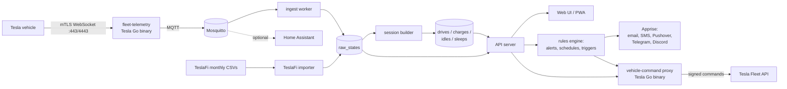

# teslai: Architecture Proposal (for review, nothing built yet)

**Goal.** A self-hosted or free-to-host replacement for [TeslaFi](https://www.teslafi.com/): log every drive, charge, idle and sleep period; analyze and report on it; control and automate the car; and bring years of existing TeslaFi history across without losing comparability.

**Status.** Draft 1, 2026-09-14. Awaiting owner review. No code will be written until the decisions in the last section are made.

---

## 1. Findings that shape the design

### 1.1 How data can be obtained from a Tesla in 2026

| Path | State in Sept 2026 | Verdict |
|---|---|---|
| Unofficial **Owner API** (`owner-api.teslamotors.com`, polling `vehicle_data`) | TeslaMate docs still say it works for individuals, but since June 2026 users report `403 forbidden, see developer.tesla.com/docs/fleet-api` on personal accounts ([#5399](https://github.com/teslamate-org/teslamate/issues/5399), [#5385](https://github.com/teslamate-org/teslamate/discussions/5385)). No official shutdown date. | **Do not build on it.** A new project would inherit a dying dependency. |
| Official **Fleet API** (REST: vehicle data, commands, wake, charging history) | Pay-per-use since 2025-01-01, with a $10/month credit per account. Commands need a **virtual key** and Tesla's signing proxy. | **Use** for setup, commands, and occasional reads. |
| Official **Fleet Telemetry** (car pushes to *your* server over mTLS WebSocket) | The supported path. Car streams on change, subject to a per-field minimum interval. Needs a public hostname, TLS certs, a registered developer app, and a public key served from that domain. | **Primary ingestion path.** |

Fleet API unit prices ([Teslemetry summary](https://teslemetry.com/blog/tesla-fleet-api-pay-per-use)):

| Unit | Price |
|---|---|
| Streaming signal | $0.0001 |
| Command | $0.001 |
| `vehicle_data` request | $0.002 |
| Wake | $0.02 |

Tesla's own guidance is that the $10 credit roughly covers streaming, 100 commands and 2 wakes per day for two vehicles. **Design rule: never wake the car to log.** Streaming only happens when the car is awake anyway, so sleep is observed as silence, not by polling.

### 1.2 What TeslaFi does (public review)

From teslafi.com's public feature pages. **A logged-in review of your account has not been done yet** (see section 8).

- **Logging:** drives (map, distance, time, energy, efficiency), charges (energy, battery %, cost), idle/sleep (duration, range loss, conditioning drain), manual gap entry.
- **Analytics:** labeled places with geofences and auto-tagging, nav-destination labels, "driveprint" cell coverage map, lifetime route map, temperature and speed vs. efficiency, FSD miles per drive, day/month/year/range totals, trips grouping drives and charges.
- **Charging:** flat or time-of-use home rates, Supercharger invoice matching, battery degradation report compared to similar cars.
- **Alerts:** unlocked, windows down, low tire pressure, drive started, charge complete, Sentry events, plug-in reminders, service reminders with cost and photos. Channels are email, SMS, Pushover, Telegram, Discord.
- **Control and automation:** live controls, schedules, climate presets, arrival triggers, auto-Sentry.
- **Integrations:** JSON feed plus command API, Alexa, CSV and full-history export, time-limited location sharing, public drive and trip share links.
- **Community:** software rollout tracker, leaderboards, fleet statistics. These need thousands of users and cannot be replicated by a single-owner app.

### 1.3 Existing open-source options (build vs. adopt)

This is a real alternative to building, so it is stated up front.

| Project | Stack | Tesla source | TeslaFi import | Notes |
|---|---|---|---|---|
| [TeslaMate](https://github.com/teslamate-org/teslamate) | Elixir, Postgres, Grafana | Owner API first; Fleet API documented as "for business fleet users" | Yes, beta | Most mature. Grafana dashboards, not an app. Exposed to Owner API loss. |
| [TeslaLogger](https://github.com/bassmaster187/TeslaLogger) | C#/.NET, MariaDB, PHP | Fleet API plus self-hosted telemetry | Yes | Mature, dated UI. |
| [teslog-web](https://github.com/steveneppler/teslog-web) | Laravel, SQLite, MQTT | Self-hosted Fleet Telemetry | Yes | Closest to this proposal's shape. Very young (3 stars, 37 commits). |

**Recommendation: build, but copy the proven plumbing.** All three are single-purpose loggers. None matches TeslaFi's reports, automations and alerts as one app, and none is designed around reconciling imported history against the source. Adopting TeslaLogger or teslog-web is the fallback if build cost turns out too high. Section 9 asks you to confirm.

---

## 2. System overview

### Components

| Component | Choice | Why |
|---|---|---|
| Telemetry receiver | [`teslamotors/fleet-telemetry`](https://github.com/teslamotors/fleet-telemetry), unmodified | Tesla-maintained reference server. Handles mTLS and protobuf decoding. |
| Message bus | Mosquitto (MQTT dispatcher) | Built-in dispatcher. Buffers if the app restarts. Gives Home Assistant integration for free. |
| Command signing | [`teslamotors/vehicle-command`](https://github.com/teslamotors/vehicle-command) HTTP proxy | Required for commands on current cars. Holds the app's private key. |
| Backend | Python 3.12, FastAPI, SQLAlchemy, a single `worker` process for ingest, sessions and rules | Your working language. Analytics and imports are easiest in Python (pandas/polars for reconciliation). |
| Database | PostgreSQL 16 + PostGIS | Concurrent ingest and reads, geofences as real polygons, spatial queries for places and route maps. TimescaleDB is not needed at single-car volume. |
| Frontend | React + Vite + TypeScript, MapLibre GL, ECharts, installable PWA | Mobile-first like the Tesla app. Push notifications via PWA as an extra channel. |
| Notifications | [Apprise](https://github.com/caronc/apprise) | One library covers every TeslaFi channel. |
| Reverse proxy | Caddy | Automatic Let's Encrypt for the web UI and the key file. |
| Packaging | One `docker compose` file | Same deployment on a cloud VM or the Mac Mini. |

---

## 3. Data model

The key decision: **historical and live data go through the same pipeline.** TeslaFi CSV rows and live telemetry both become rows in `raw_states`. One session builder derives drives, charges, idles and sleeps from it. That makes 2019 and 2026 numbers computed identically, so trends are real and not artifacts of two different algorithms.

**Core tables**

- `vehicles` — VIN, name, model, trim, battery config, HW version.
- `raw_states` — `(vehicle_id, ts)` primary key; nullable typed columns for the ~60 fields used (location, speed, gear, SOC, ranges, energy, charger power/voltage/current, charge state, temps, TPMS, locks, doors, windows, sentry, odometer, firmware, FSD miles); `source` = `telemetry | teslafi_import | manual | api`. Partitioned by month.
- `drives`, `charges`, `idles`, `sleeps` — derived sessions with start/end refs into `raw_states`, cached aggregates, `builder_version`.
- `places` — PostGIS polygon, name, category, home charging tariff.
- `tariffs` — flat or time-of-use schedules with effective date ranges.
- `supercharger_invoices` — from Fleet API charging history, matched to `charges`.
- `trips`, `share_links`, `service_records`, `rules`, `rule_firings`, `commands_log`, `api_usage` (signals, commands and wakes counted per day for cost tracking).

**Session builder.** A deterministic state machine over ordered `raw_states`:
- Drive starts on gear leaving P (or speed > 0 when gear is missing in old data) and ends after P plus a dwell threshold.
- Charge starts when charging state becomes Charging and ends when it stops or the cable is removed.
- Sleep is inferred from gaps in telemetry beyond a threshold; idle is the remainder between sessions.
- Rebuilds are idempotent. Changing thresholds bumps `builder_version` and re-derives history.

**Geo.** Reverse geocoding via Nominatim, batched and cached, rate-limited for the public instance. Driveprint uses H3 cells computed at import and ingest.

---

## 4. TeslaFi migration

1. **Export.** TeslaFi provides raw logged data as one CSV per month (`Settings → Advanced → Download TeslaFi Data`, files named like `TeslaFi82019.csv`). Years of history means dozens of files. With a logged-in session this download can be scripted. Also export TeslaFi's own drives and charges CSVs, which are used only as the answer key.
2. **Import.** Map TeslaFi columns (which mirror the old `vehicle_data` fields: `charge_state`, `climate_state`, `drive_state`, `vehicle_state`) into `raw_states` with `source = teslafi_import`. Timestamps are in the TeslaFi home timezone and must be converted to UTC. Addresses are not in the export, so geocoding runs afterwards. TeslaMate's [importer](https://docs.teslamate.org/docs/import/teslafi/) is a reference for edge cases like `None` strings and 0/1 booleans.
3. **Reconcile.** Compare derived drives and charges against TeslaFi's own lists per month: count, miles, kWh added, cost. Target is within 1% on totals, with every mismatched session listed in a report. This is the acceptance test for the migration.
4. **Cut over.** Run TeslaFi and teslai in parallel for at least two weeks, reconcile the overlap, then cancel TeslaFi. Whether a car can stream to two telemetry configs at once needs to be checked during setup.

---

## 5. Feature parity plan

| TeslaFi feature | Phase | Data source |
|---|---|---|
| Drive, charge, idle and sleep logging with maps | v1 | Telemetry + session builder |
| TeslaFi history import with reconciliation report | v1 | Monthly CSVs |
| Places, geofences, auto-tagging | v1 | PostGIS |
| Home charging cost, flat and time-of-use | v1 | Tariffs |
| Day/month/year/range totals, efficiency vs. temperature and speed | v1 | SQL over sessions |
| CSV export and JSON API | v1 | API server |
| Live status and basic controls (lock, climate, charge, sentry) | v1 | vehicle-command proxy |
| Alerts: unlocked, windows, TPMS, charge complete, drive started, plug-in reminder | v2 | Rules engine + Apprise |
| Schedules, climate presets, arrival triggers, auto-Sentry | v2 | Rules engine |
| Battery degradation report | v2 | Own history only. No "similar cars" comparison. |
| Supercharger invoice matching | v2 | Fleet API charging history |
| FSD miles per drive | v2 | `SelfDrivingMilesSinceReset`, HW4 on 2025.44.25.5+ only |
| Driveprint, lifetime route map, trips, public share links, location sharing | v2 | H3 + share tokens |
| Service log with photos, manual entry | v2 | Local file storage |
| Home Assistant | v2 | MQTT, nearly free |
| Alexa | Out | Low value; revisit later |
| Software tracker, leaderboards, fleet stats | Out | Needs a user base. Can link to TeslaFi or Teslascope public pages. |

---

## 6. Hosting options

The hard requirement: **the car must reach a public hostname with mTLS end-to-end.** TLS-terminating tunnels such as Cloudflare Tunnel break this, because the telemetry server must see the car's client certificate.

| Option | Cost | Pros | Cons |
|---|---|---|---|
| **A. Oracle Cloud Always Free ARM VM + cheap domain** (recommended) | About $10/yr for the domain | Static public IP, always up, 4 cores and 24 GB RAM free, ordinary port 443/4443 | Oracle can reclaim idle free instances. Needs off-box backups. |
| B. Mac Mini at home | $0 plus domain | Hardware you already run, data stays home | Needs router port-forward or a passthrough tunnel. Home outages mean data gaps. Was unreachable over SSH during this review. |
| C. Mac Mini behind Tailscale Funnel raw TCP (`--tcp` on 443/8443/10000) | $0 | No router changes | Hostname is `*.ts.net`. Unverified whether Tesla accepts that domain for app registration. Treat as experimental. |
| D. Free PaaS (Fly, Render, Railway) | — | — | Sleeping containers, no stable raw TCP with mTLS, ephemeral disk. Not suitable. |

**Backups.** Nightly `pg_dump` to Cloudflare R2 or Backblaze B2 free tier, plus a copy pulled to the Mac Mini. Test restore monthly.

**Running cost.** Target is $0/month to Tesla by staying inside the $10 credit. `api_usage` tracking shows the projection on a settings page, with streaming intervals tunable if it drifts.

---

## 7. Security

- Single-owner app: one account, passkey or TOTP login, registration closed after first run.
- Tesla OAuth tokens and the command-signing private key encrypted at rest. The key never leaves the proxy container.
- Commands rate-limited and fully logged. No commands allowed from public share links.
- Share links are time-limited, revocable tokens with coarse location after expiry.
- Public repo: all secrets live in `.env` files that are git-ignored. TeslaFi exports stay out of the repo.

---

## 8. Not done yet

- **Logged-in review of your TeslaFi account.** No credentials were provided in the session, and the local browser cookie store was not readable. That review should confirm: the export formats and columns, first data date and data volume, which features you actually use, number of vehicles, and your configured tariffs and places. Places and tariffs should be migrated too, if exportable.
- **Owner API status for your account.** Unverified; it does not change the design.
- **Mac Mini capacity.** SSH timed out on both the Tailscale and LAN addresses.

---

## 9. Decisions needed before building

1. **Build vs. adopt.** Build as proposed, or adopt TeslaLogger or teslog-web and only add what's missing?
2. **Hosting.** Oracle free VM (A), Mac Mini with port-forward (B), or Mac Mini with Funnel (C)?
3. **Domain.** Which domain or subdomain the car will stream to and the Tesla app will be registered under.
4. **Vehicles.** How many cars, which models and hardware versions? This affects FSD miles and API cost.
5. **Stack.** Python + React + Postgres as proposed, or a preference such as SQLite or TypeScript end-to-end?
6. **Scope of v1.** Is the v1 row set in section 5 right?
7. **TeslaFi access.** Provide credentials (via a local `.env`, never the repo) for the logged-in review and scripted export.

## Sources

- [TeslaFi](https://www.teslafi.com/)
- [Tesla Fleet API](https://developer.tesla.com/docs/fleet-api), [billing and limits](https://developer.tesla.com/docs/fleet-api/billing-and-limits), [announcements](https://developer.tesla.com/docs/fleet-api/announcements), [telemetry fields](https://developer.tesla.com/docs/fleet-api/fleet-telemetry/available-data)
- [Teslemetry: Fleet API pay-per-use](https://teslemetry.com/blog/tesla-fleet-api-pay-per-use)
- [teslamotors/fleet-telemetry](https://github.com/teslamotors/fleet-telemetry)
- [TeslaMate API docs](https://docs.teslamate.org/docs/configuration/api/), [TeslaFi import](https://docs.teslamate.org/docs/import/teslafi/), [issue #5399](https://github.com/teslamate-org/teslamate/issues/5399), [discussion #5385](https://github.com/teslamate-org/teslamate/discussions/5385)
- [TeslaLogger](https://github.com/bassmaster187/TeslaLogger), [self-hosted telemetry guide](https://blog.enumc.com/setting-up-teslalogger-with-a-self-hosted-telemetry-server/)
- [teslog-web](https://github.com/steveneppler/teslog-web)
- [Tailscale Funnel CLI](https://tailscale.com/docs/reference/tailscale-cli/funnel)
