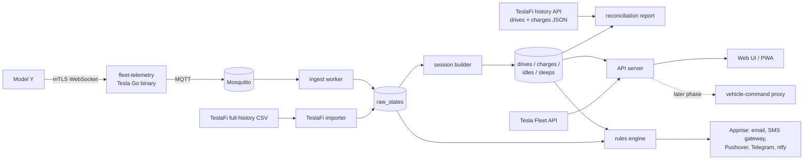

# teslai: Architecture Proposal (for review, nothing built yet)

**Goal.** A self-hosted or free-to-host replacement for [TeslaFi](https://www.teslafi.com/): log every drive, charge, idle and sleep; report on it; alert on it; and bring the full TeslaFi history across without losing comparability.

**Status.** Draft 2, 2026-09-14. Revised after a logged-in review of the owner's TeslaFi account. Awaiting owner review. No code until section 10 is answered.

**What changed from draft 1.**
- TeslaFi already runs this car on Tesla's official Fleet Telemetry, which confirms the ingestion design. Its exact field list is adopted below.
- Vehicle controls are **disabled** in the account, with zero commands and zero wakes used. Commands, schedules and triggers move from v1 to an optional later phase.
- Alerts, drive and charge summaries, charging-cost accounting with free-charging credits, and the battery report are what the account actually uses. Those become v1.
- Migration is simpler than expected. TeslaFi offers the complete raw history as a single CSV, plus a JSON history API for drives and charges to reconcile against.

---

## 1. Account review findings

Scope of the review: every Settings, Drives, Charges, Parked, Calendar, Controls and API page, read from a logged-in browser session. Personal details such as places, addresses and vehicle identifiers are deliberately left out of this public document.

| Area | What the account shows | Design consequence |
|---|---|---|
| Vehicles | One Model Y Long Range, current 2026.26 firmware, FSD in regular use | Single-vehicle design, multi-vehicle-ready schema. FSD-mile fields are available. |
| History | 46 months of raw data, Dec 2022 to Sep 2026. About 3,100 drives, 12,400 idles and 8,500 sleeps. | Small data: tens of millions of rows at most. No time-series database needed. |
| Connection | Fleet Telemetry with the TeslaFi Fleet Key installed. Sleep modes are unnecessary. Tesla logged connection timeouts to TeslaFi's server on 2026-09-07. | Same approach. The receiving endpoint must be always-on. |
| Telemetry fields | 59 fields subscribed (listed in section 4) | Use the same field set, so live data matches history column-for-column. |
| Controls | TeslaFi Controls set to Disabled. This month: 0 data calls, 0 commands, 0 wakes. 0 triggers. One climate preset and 3 stale schedules exist but cannot run. | Commands are not v1. |
| Alerts in use | SMS: doors unlocked away from home, windows open, tire pressure low or high, logging offline. Email and Pushover: new software version. Email summaries for drives and charges. | Rules engine and notifications are v1. |
| Charging | Home time-of-use price schedule. Gas-savings comparison configured. Hundreds of Supercharger sessions, all $0 on credit miles, with invoices auto-downloaded. Frequent free public charging. | Cost model must handle TOU, free locations, and Supercharger credits as well as paid kWh. |
| Battery | Degradation report used, including the TeslaFi fleet-average comparison | Own-history trend in v1. The fleet average cannot be replicated. |
| Places | About 60 labeled locations, auto-tag radius set, auto-label destinations enabled | Places must be migrated. TeslaFi has no export for them, so scrape the Locations page once. |
| Preferences | Auto-end drive when offline, conditioning-loss display, home heatmap, idle maps, Sentry timer | Session-builder settings and a few v1 views. |
| Cost today | TeslaFi Monthly Logging at $7.99/month | Replacement target: $0/month to Tesla plus about $10/year for a domain. |
| Account security | TeslaFi two-factor authentication is not enabled | Worth enabling now, independent of this project. |

---

## 2. How data is obtained from a Tesla in 2026

| Path | State | Verdict |
|---|---|---|
| Unofficial **Owner API** | Personal accounts reported getting `403 forbidden, see developer.tesla.com/docs/fleet-api` since June 2026 ([#5399](https://github.com/teslamate-org/teslamate/issues/5399)). | Do not use. |
| Official **Fleet API** (REST) | Pay-per-use since 2025-01-01 with a $10/month credit per account. Commands need a virtual key and Tesla's signing proxy. | Setup, token refresh, Supercharger history, and later commands. |
| Official **Fleet Telemetry** (car pushes to your server over mTLS) | The supported path, and what TeslaFi uses for this car. | Primary ingestion. |

Fleet API prices ([summary](https://teslemetry.com/blog/tesla-fleet-api-pay-per-use)):

| Unit | Price |
|---|---|
| Streaming signal | $0.0001 |
| Command | $0.001 |
| `vehicle_data` request | $0.002 |
| Wake | $0.02 |

**Design rule: never wake the car to log.** Streaming happens only while the car is awake, so sleep shows up as silence. An `api_usage` table counts signals and requests per day and projects the monthly bill against the $10 credit.

---

## 3. Build vs. adopt

| Project | Stack | Tesla source | TeslaFi import |
|---|---|---|---|
| [TeslaMate](https://github.com/teslamate-org/teslamate) | Elixir, Postgres, Grafana | Owner API first | Yes, beta |
| [TeslaLogger](https://github.com/bassmaster187/TeslaLogger) | C#/.NET, MariaDB, PHP | Fleet API + self-hosted telemetry | Yes |
| [teslog-web](https://github.com/steveneppler/teslog-web) | Laravel, SQLite, MQTT | Self-hosted telemetry | Yes |

**Recommendation: build, reusing Tesla's two open-source servers for the hard plumbing.** The account review strengthens this. The features actually used are alerts, summaries, cost accounting with credits, and battery trend. The existing projects are weakest exactly there, while their strength, vehicle control, is unused. TeslaLogger remains the fallback if build effort becomes the constraint.

---

## 4. System overview

| Component | Choice | Why |
|---|---|---|
| Telemetry receiver | [`teslamotors/fleet-telemetry`](https://github.com/teslamotors/fleet-telemetry), unmodified | Tesla-maintained. Handles mTLS and decoding. |
| Message bus | Mosquitto (built-in MQTT dispatcher) | Buffers across app restarts. Home Assistant integration for free. |
| Backend | Python 3.12, FastAPI, SQLAlchemy; one `worker` process for ingest, sessions and rules | Owner's working language. pandas or polars for import and reconciliation. |
| Database | PostgreSQL 16 + PostGIS | Concurrent ingest and reads, real geofence polygons, spatial queries. |
| Frontend | React + Vite + TypeScript, MapLibre GL, ECharts, installable PWA | Mobile-first. Web push as a free alert channel. |
| Notifications | [Apprise](https://github.com/caronc/apprise) | Covers email, Pushover, Telegram, Discord, ntfy and email-to-SMS gateways in one library. |
| Reverse proxy | Caddy | Automatic certificates for the web UI and Tesla's public-key URL. |
| Command signing | [`teslamotors/vehicle-command`](https://github.com/teslamotors/vehicle-command) proxy | Later phase only, because controls are unused today. |
| Packaging | One `docker compose` file | Same deployment on a cloud VM or the Mac Mini. |

**Telemetry field set.** Adopt TeslaFi's subscription for this car: ACChargingEnergyIn, ACChargingPower, BatteryHeaterOn, BatteryLevel, CabinOverheatProtectionMode, ChargeAmps, ChargeCurrentRequest, ChargeLimitSoc, ChargePort, ChargePortColdWeatherMode, ChargeRateMilePerHour, ChargerPhases, ChargerVoltage, ChargingCableType, DCChargingEnergyIn, DCChargingPower, DefrostMode, DestinationName, DetailedChargeState, DoorState, EnergyRemaining, EstBatteryRange, EuropeVehicle, FastChargerPresent, FastChargerType, FdWindow, FpWindow, Gear, HvacFanStatus, HvacLeftTemperatureRequest, HvacPower, IdealBatteryRange, InsideTemp, LifetimeEnergyUsed, Location, Locked, MilesSinceReset, MinutesToArrival, Odometer, OutsideTemp, PackCurrent, PackVoltage, RatedRange, RdWindow, RightHandDrive, RouteLine, RpWindow, ScheduledChargingStartTime, SelfDrivingMilesSinceReset, SentryMode, SoftwareUpdateVersion, TpmsPressureFl, TpmsPressureFr, TpmsPressureRl, TpmsPressureRr, VehicleName, VehicleSpeed, Version, WheelType. Per-field minimum intervals get tuned against the $10 credit.

---

## 5. Data model

**One pipeline for history and live data.** TeslaFi CSV rows and live telemetry both become `raw_states` rows. One session builder derives drives, charges, idles and sleeps from both. Numbers from 2022 and 2026 are therefore computed identically.

**Core tables**
- `vehicles` — VIN, name, model, trim, hardware.
- `raw_states` — `(vehicle_id, ts)` key; typed nullable columns for the fields above; `source` = `telemetry | teslafi_import | manual`. Partitioned by month.
- `drives`, `charges`, `idles`, `sleeps` — derived sessions with cached aggregates and `builder_version`.
- `places` — PostGIS polygon or radius, name, icon, tariff, `free_charging` flag.
- `tariffs` — flat or time-of-use schedules with effective dates.
- `supercharger_sessions` — from Fleet API charging history: kWh, fee, currency, credit applied. Matched to `charges`.
- `gas_baseline` — fuel price and MPG with effective dates, for the gas-savings comparison.
- `rules`, `rule_firings`, `notification_channels`, `api_usage`, `share_links`, `service_records`.

**Session builder.** A deterministic state machine over ordered `raw_states`:
- A drive starts when gear leaves P, or speed exceeds 0 where gear is missing. It ends after P plus a dwell threshold, or after N minutes offline, matching TeslaFi's "auto-end drive when offline" setting.
- A charge follows charging state and cable presence.
- Sleep is a telemetry gap beyond a threshold. Idle is the remainder, with conditioning loss attributed from HVAC state.
- Rebuilds are idempotent. Changing thresholds bumps `builder_version` and re-derives everything.

---

## 6. TeslaFi migration

1. **Raw history.** Download "everything at once" from TeslaFi's Advanced settings: one CSV of the full logging history. Per-month CSVs are the fallback if the single file times out.
2. **Answer key.** Pull drives and charges as JSON from TeslaFi's history API, month by month using `dateFrom` and `dateTo`. This needs a TeslaFi API token generated in Settings. The token is stored in a git-ignored `.env`.
3. **Places, tariffs and gas baseline.** No export exists. Scrape the Locations, Home Charging and Gas Savings pages once from a logged-in session, then review the result by hand.
4. **Import.** Map CSV columns into `raw_states`. Convert TeslaFi's home-timezone timestamps to UTC. Treat `None` strings as null and 0/1 as booleans. TeslaMate's [importer](https://docs.teslamate.org/docs/import/teslafi/) documents the edge cases.
5. **Reconcile.** For each month, compare derived sessions against the answer key: drive count, miles, kWh used, charge count, kWh added, cost. Acceptance means totals within 1%, with every unmatched session listed. This is the migration's pass/fail test.
6. **Cut over.** Run both in parallel for at least two weeks and reconcile the overlap, then cancel TeslaFi. It must be verified during setup whether the car can stream to TeslaFi's and teslai's telemetry servers at the same time. If not, cut over directly, with the full-history CSV as the backstop.

---

## 7. Feature plan, grounded in actual use

| Feature | Phase | Evidence from account |
|---|---|---|
| Drive, charge, idle and sleep logs with maps | v1 | Core use |
| Full TeslaFi import with reconciliation report | v1 | 46 months of history |
| Places with auto-tagging; unlabeled-location list | v1 | About 60 labeled places |
| Charging cost: TOU, free locations, Supercharger credits, gas savings | v1 | All configured |
| Alerts: unlocked away from home, windows open, tire pressure, logging offline, new software | v1 | All enabled |
| Drive and charge email summaries | v1 | Enabled |
| Day, week, month and year calendar views and totals | v1 | Home screen is the day view |
| Battery degradation trend | v1 | Report in use |
| Temperature and speed efficiency, tire pressure graph, odometer graph | v1 | Cheap once sessions exist |
| CSV export and JSON API | v1 | Keeps the data portable |
| FSD miles per drive and lifetime share | v1 | Shown in the account header |
| Lifetime map, driveprint, road trips, share links | v2 | Nice to have |
| Service reminders and log | v2 | Page exists but empty |
| Home Assistant via MQTT | v2 | Nearly free |
| Commands, schedules, triggers, climate presets | Later, optional | Controls disabled; 0 commands used |
| Auto-label destinations from nav | Later | TeslaFi uses Mapbox and Grok; Nominatim plus `DestinationName` is the free version |
| Alexa, software tracker, leaderboards, fleet statistics, fleet battery average | Out | Unused, or needs a user base |

**SMS.** TeslaFi includes 250 SMS a month. Free alternatives are Pushover (one-time app purchase), Telegram, ntfy, or an email-to-SMS carrier gateway. Paid SMS such as Twilio is possible but not the default.

---

## 8. Hosting

Hard requirement: the car must reach a public hostname with **end-to-end mTLS**. TLS-terminating tunnels such as Cloudflare Tunnel cannot sit in front of the telemetry server. The 2026-09-07 connection timeouts to TeslaFi show that an unreachable endpoint means lost or delayed data.

| Option | Cost | Pros | Cons |
|---|---|---|---|
| **A. Oracle Cloud Always Free ARM VM + domain** (recommended) | About $10/yr | Static public IP, always on, 4 cores and 24 GB RAM free | Oracle can reclaim idle free instances. Needs off-box backups. |
| B. Mac Mini at home with a router port-forward | $0 + domain | Data stays home, existing hardware | Home outages mean gaps. Was unreachable over SSH during review. |
| C. Mac Mini behind Tailscale Funnel raw TCP | $0 | No router changes | `*.ts.net` hostname may not be accepted by Tesla. Experimental. |
| D. Free PaaS such as Fly, Render or Railway | — | — | Sleeping containers, no stable mTLS TCP, ephemeral disks. Not suitable. |

**Backups.** Nightly `pg_dump` to Cloudflare R2 or Backblaze B2 free tier, plus a copy to the Mac Mini. Monthly restore test.

---

## 9. Security

- Single-owner app with passkey or TOTP login. Registration closes after first run.
- Tesla tokens encrypted at rest. The signing key, when commands are added, stays inside the proxy container.
- Share links are time-limited and revocable.
- The repo is public. Secrets, TeslaFi credentials and tokens, TeslaFi exports, and scraped places live only in git-ignored paths.

---

## 10. Decisions needed before building

1. **Build vs. adopt.** Build as proposed, or adopt TeslaLogger and add only what's missing?
2. **Hosting.** Oracle free VM, Mac Mini with port-forward, or Mac Mini with Funnel?
3. **Domain.** Which domain or subdomain will the car stream to?
4. **Stack.** Python + React + Postgres as proposed, or a different preference?
5. **v1 scope.** Is section 7's v1 list right, with commands deferred?
6. **Alert channel.** Which replaces TeslaFi SMS: Pushover, Telegram, ntfy, email-to-SMS, or paid SMS?
7. **Migration timing.** Generate the TeslaFi API token and download the full CSV now, or wait until the importer exists? Downloading now protects the history if the subscription lapses.

## Sources

- [TeslaFi](https://www.teslafi.com/), plus the owner's logged-in account pages
- [Tesla Fleet API](https://developer.tesla.com/docs/fleet-api), [billing and limits](https://developer.tesla.com/docs/fleet-api/billing-and-limits), [announcements](https://developer.tesla.com/docs/fleet-api/announcements), [telemetry fields](https://developer.tesla.com/docs/fleet-api/fleet-telemetry/available-data)
- [Teslemetry pricing summary](https://teslemetry.com/blog/tesla-fleet-api-pay-per-use)
- [teslamotors/fleet-telemetry](https://github.com/teslamotors/fleet-telemetry)
- [TeslaMate API docs](https://docs.teslamate.org/docs/configuration/api/), [TeslaFi import](https://docs.teslamate.org/docs/import/teslafi/), [issue #5399](https://github.com/teslamate-org/teslamate/issues/5399)
- [TeslaLogger](https://github.com/bassmaster187/TeslaLogger), [self-hosted telemetry guide](https://blog.enumc.com/setting-up-teslalogger-with-a-self-hosted-telemetry-server/)
- [teslog-web](https://github.com/steveneppler/teslog-web)
- [Tailscale Funnel](https://tailscale.com/docs/reference/tailscale-cli/funnel)
