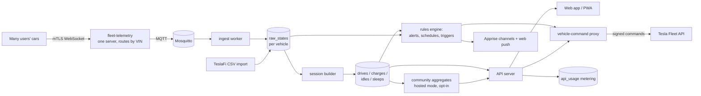

# teslai: Architecture Proposal (for review, nothing built yet)

**Goal.** A product that replicates everything TeslaFi offers. The owner uses it first. It then opens to other Tesla owners as a hosted service, with the same code published for anyone to self-host.

**Status.** Draft 3, 2026-09-14. All build-blocking decisions are made. Phases 0 through 3 can start on the owner's go-ahead. The product name and domain are due before phase 4.

## Decisions made

| Decision | Choice | Date |
|---|---|---|
| Scope | Full TeslaFi parity, including controls, automations and community features | 2026-09-14 |
| Distribution | Hosted service first; open-source code others can self-host | 2026-09-14 |
| Pricing | Free invite-only beta; per-car usage metering from day one; pricing decided later | 2026-09-14 |
| Hosting | Oracle Cloud Always Free VM to start | 2026-09-14 |
| TeslaFi history | Downloaded once the importer exists | 2026-09-14 |
| Build vs. adopt | Build. Existing loggers are single-user tools, not products. | 2026-09-14 |
| Alert channels | Support all TeslaFi channels through one library | 2026-09-14 |
| Stack | Python 3.12 + FastAPI, React + Vite + TypeScript, PostgreSQL 16 + PostGIS | 2026-09-14 |
| License | MIT | 2026-09-14 |
| Legal entity | Owner registers the Tesla developer app personally for self-use; an LLC is formed before the beta | 2026-09-14 |
| Product name | Chosen before the beta. "teslai" stays the internal repo name. | 2026-09-14 |

**Changes from draft 2.**
- Commands, schedules, triggers and community features are back in scope.
- The design is multi-tenant from the first migration, even while the owner is the only user.
- The side-by-side run with TeslaFi is unlikely to work, so cutover is replaced with import-first validation.
- New product-launch requirements are covered: naming, Tesla app registration, legal pages and licensing.

---

## 1. Findings that shape the design

### 1.1 Owner's TeslaFi account (logged-in review, 2026-09-14)

Personal details are deliberately left out of this public document.

| Area | Finding | Consequence |
|---|---|---|
| Connection | TeslaFi streams this car through Fleet Telemetry with 59 fields | Adopt the same field set (section 5) |
| History | 46 months of raw data, Dec 2022 to Sep 2026. About 3,100 drives, 12,400 idles and 8,500 sleeps. Full history is downloadable as one CSV. | Import is the first real test of the session builder |
| Controls | Disabled today, zero commands used | Controls are built for parity, but later in the order |
| Alerts in use | Unlocked away from home, windows open, tire pressure, logging offline, new software, drive and charge email summaries | Early phase |
| Charging | Home time-of-use rates, free public charging, Supercharger sessions on credit miles, gas-savings baseline | Cost model must handle all of these |
| Places | About 60 labeled locations, with no export | One-time scrape during migration |
| TeslaFi price | $7.99/month | Reference point for future pricing |

### 1.2 Tesla platform constraints

| Constraint | Detail | Source |
|---|---|---|
| Owner API | Personal accounts getting 403 since June 2026. Not usable. | [TeslaMate #5399](https://github.com/teslamate-org/teslamate/issues/5399) |
| Fleet API pricing | Signal $0.0001, command $0.001, data request $0.002, wake $0.02. $10/month credit. | [Teslemetry](https://teslemetry.com/blog/tesla-fleet-api-pay-per-use), [Tesla billing](https://developer.tesla.com/docs/fleet-api/billing-and-limits) |
| Tesla's cost example | About $0.36/day per car for about an hour of driving or charging daily | [Not a Tesla App](https://www.notateslaapp.com/news/2415/tesla-announces-api-pricing-third-party-service-costs-expected-to-rise) |
| Public app registration | Requires legal business details, app name, description and purpose. Name must be unique. Registration is repeated per region. Request only the scopes the app needs. Selling personal data is prohibited. | [Tesla: What is Fleet API](https://developer.tesla.com/docs/fleet-api/getting-started/what-is-fleet-api), [Tesla third-party apps](https://www.tesla.com/support/access-third-party-apps) |
| Telemetry configs per car | Up to 3, but a second app configuring telemetry on a car already streaming to another app returns `config: null`. Tesla's bug is open and marked high priority. | [fleet-telemetry #294](https://github.com/teslamotors/fleet-telemetry/issues/294) |
| Trademarks | Tesla's guidelines prohibit using Tesla trademarks as part of a product or service name, or implying endorsement | [Tesla legal resources](https://www.tesla.com/legal/additional-resources) |

### 1.3 Hosting constraint

Oracle halved the Always Free Ampere allowance on 2026-06-15, without announcement, to **2 cores and 12 GB of RAM**, plus 200 GB block storage. Idle free instances can be reclaimed. ([InfoQ](https://www.infoq.com/news/2026/07/oracle-cloud-free-tier-limits/), [Oracle docs](https://docs.oracle.com/en-us/iaas/Content/FreeTier/freetier_topic-Always_Free_Resources.htm)) That is enough for the owner plus a small beta. Oracle can change terms silently, so the whole stack must be portable to a paid host in under an hour.

---

## 2. Unit economics: the risk to watch

For others, the hosted service pays Tesla for every car. Tesla's example of about $0.36/day works out to roughly $11/month per car. That is above TeslaFi's $7.99 price, and the $10 credit applies once per developer account, not per car.

Mitigations, built in from day one:
- **Metering.** Count signals, commands and wakes per car per day in `api_usage`. An admin page shows cost per car and the monthly projection.
- **Interval tuning.** Per-field minimum intervals and deltas; fast updates only while driving or charging. The real per-car cost is measured on the owner's car before any beta invite.
- **Never wake to log.** Wakes are the most expensive unit and are only used for user-initiated commands.
- **Beta cap.** The invite count is limited by measured cost and the free server's capacity.

---

## 3. Deployment modes

One codebase and one set of containers, with a mode switch.

| | Hosted service | Self-hosted |
|---|---|---|
| Who registers the Tesla app | The service, once, under the product's legal entity | Each self-hoster, with their own developer account and domain |
| Onboarding | Sign up, log in with Tesla, scan a QR code to install the virtual key | Setup wizard walks through developer registration, keys, domain and pairing |
| Tesla API costs | Paid by the service; metered per car | Paid by the self-hoster, usually inside the $10 credit |
| Community features | Available, opt-in per user | Off by default. Could later send opt-in anonymized contributions to the hosted service. |
| Users | Many accounts, invite-gated | Typically one household |

---

## 4. System overview

| Component | Choice | Why |
|---|---|---|
| Telemetry receiver | [`teslamotors/fleet-telemetry`](https://github.com/teslamotors/fleet-telemetry) | Tesla-maintained and built for fleets, so one instance serves every user's car. |
| Command signing | [`teslamotors/vehicle-command`](https://github.com/teslamotors/vehicle-command) HTTP proxy | Required for commands. Holds the app's private key. |
| Message bus | Mosquitto (built-in dispatcher) | Buffers across restarts. Enough for beta scale. NATS or Kafka become options if volume demands. |
| Backend | Python 3.12, FastAPI, SQLAlchemy, Alembic; separate `worker` process for ingest, sessions, rules and scheduled jobs | Owner's working language. Strong data tooling for import, reconciliation and reports. |
| Database | PostgreSQL 16 + PostGIS, with row-level security per account | Tenant isolation enforced by the database, not just app code. Real geofences and spatial queries. |
| Frontend | React + Vite + TypeScript, MapLibre GL, ECharts, installable PWA | Mobile-first, with web push. |
| Notifications | [Apprise](https://github.com/caronc/apprise) + web push | Email, Pushover, Telegram, Discord, ntfy and SMS gateways in one library. |
| Email | A transactional email provider's free tier | Summaries, alerts and account email. The provider is chosen at build time. |
| Reverse proxy | Caddy | Automatic certificates, plus serving Tesla's public-key URL. |
| Packaging | `docker compose`, one file for both modes | Same artifact for Oracle, a paid host, or a self-hoster's box. |

---

## 5. Data model

**Tenancy from the first migration.** `accounts` → `users` (members, roles) → `vehicles`. Every row carries `account_id`. Postgres row-level security policies enforce isolation, and the API sets the current account per request.

**One pipeline for history and live data.** TeslaFi CSV rows and live telemetry both land in `raw_states`. One session builder derives every session, so imported and live numbers are computed identically.

**Core tables**
- `accounts`, `users`, `memberships`, `invites`, `sessions`, `audit_log`.
- `tesla_connections` — encrypted OAuth tokens, scopes, region, virtual key status, telemetry config status.
- `vehicles` — VIN, name, model, trim, hardware, firmware history.
- `raw_states` — `(vehicle_id, ts)` key, typed nullable columns for the telemetry fields, `source`. Partitioned by month.
- `drives`, `charges`, `idles`, `sleeps` — derived sessions with cached aggregates and `builder_version`; `hidden` and `manual` flags.
- `places` — PostGIS geometry, name, icon, tariff, `free_charging`; `auto_tag_rules`.
- `tariffs`, `gas_baselines`, `supercharger_sessions` — invoices, fees, credits, currency.
- `rules` (alerts), `schedules`, `triggers`, `climate_presets`, `rule_firings`, `commands_log`.
- `notification_channels`, `email_summaries`.
- `service_reminders`, `service_log`, `attachments`.
- `trips`, `share_links`, `location_shares`.
- `api_tokens` — the user-facing JSON API.
- `api_usage` — per-vehicle daily signal, command, wake and data-request counts, with estimated cost.
- `community_*` — opt-in aggregates: firmware rollouts, leaderboards, fleet statistics, battery degradation by model and odometer band.

**Telemetry field set**, adopted from TeslaFi's subscription: ACChargingEnergyIn, ACChargingPower, BatteryHeaterOn, BatteryLevel, CabinOverheatProtectionMode, ChargeAmps, ChargeCurrentRequest, ChargeLimitSoc, ChargePort, ChargePortColdWeatherMode, ChargeRateMilePerHour, ChargerPhases, ChargerVoltage, ChargingCableType, DCChargingEnergyIn, DCChargingPower, DefrostMode, DestinationName, DetailedChargeState, DoorState, EnergyRemaining, EstBatteryRange, EuropeVehicle, FastChargerPresent, FastChargerType, FdWindow, FpWindow, Gear, HvacFanStatus, HvacLeftTemperatureRequest, HvacPower, IdealBatteryRange, InsideTemp, LifetimeEnergyUsed, Location, Locked, MilesSinceReset, MinutesToArrival, Odometer, OutsideTemp, PackCurrent, PackVoltage, RatedRange, RdWindow, RightHandDrive, RouteLine, RpWindow, ScheduledChargingStartTime, SelfDrivingMilesSinceReset, SentryMode, SoftwareUpdateVersion, TpmsPressureFl, TpmsPressureFr, TpmsPressureRl, TpmsPressureRr, VehicleName, VehicleSpeed, Version, WheelType.

**Session builder.** A deterministic, idempotent state machine:
- A drive starts when gear leaves P, or speed exceeds 0 where gear is missing. It ends after P plus a dwell time, or after N minutes offline.
- A charge follows charging state and cable presence.
- Sleep is a telemetry gap beyond a threshold. Idle is the remainder, with conditioning loss attributed from HVAC state.
- Thresholds are per-account settings. Changing them bumps `builder_version` and re-derives.

**Community data rules.** Opt-in per user. Only aggregates are published, and no statistic is shown for groups smaller than a minimum count. Leaderboards use display names chosen by the user.

---

## 6. Full TeslaFi parity map

Built from TeslaFi's complete menu as seen in the owner's account. Phases are defined in section 8.

| TeslaFi area | Features | Phase |
|---|---|---|
| **Logging core** | Drive, charge, idle and sleep logs; day view with battery chart and map; compact and filtered views | 1 |
| **Import** | TeslaFi full-history CSV import, reconciliation report, places, tariffs and gas-baseline migration | 1 |
| **Drives** | Drive summary, temperature efficiency, speed efficiency, search and CSV download, add or edit drive, hidden drives, odometer graph, FSD miles | 2 |
| **Places** | Labeled locations, label a location, unlabeled locations, auto-tag drives | 2 |
| **Charges** | Charge summary by location, search and CSV download, add charge, home TOU pricing, free locations, gas savings | 2 |
| **Battery** | Degradation report with trendline and custom starting range | 2 |
| **Parked** | Idle and sleep search and download, vampire drain, conditioning loss, Sentry time | 2 |
| **Calendar** | Year and month views with totals | 2 |
| **Tires** | Tire pressure graph and history | 2 |
| **Alerts** | Unlocked, windows, tire pressure, drive started, charge complete, logging offline, new software, Sentry events, plug-in and charge-limit reminders | 2 |
| **Channels** | Email, SMS via gateway or paid provider, Pushover, Telegram, Discord, ntfy, web push; email summaries | 2 |
| **Supercharging** | Invoice download from Fleet API charging history, matching to charges, credits and idle fees | 3 |
| **Controls** | Live controls: lock, climate, defrost, seat and wheel heat, charge start, stop, limit and amps, Sentry, valet, flash, honk | 3 |
| **Automation** | Schedules with do-not-wake option, triggers on arrival, climate presets, auto-Sentry | 3 |
| **API** | Personal API tokens, last-data JSON, drives and charges history JSON, commands with per-command enablement and wake option | 3 |
| **Accounts** | Multi-user signup, invites, Tesla OAuth onboarding, QR virtual-key install, two-factor or passkeys, login alerts, data export, account deletion | 4 |
| **Self-host** | Setup wizard, self-host documentation, upgrade path | 4 |
| **Maps and sharing** | Lifetime map, driveprint cell coverage, road trips, shared drives and trips, time-limited location sharing | 5 |
| **Service** | Service reminders by date or odometer, service log with cost and photos, image uploads | 5 |
| **Community** (hosted) | Software tracker, your software updates, latest software comparison, leaderboards, statistics map, Supercharger statistics, fleet battery-degradation average | 6 |
| **Integrations** | Home Assistant via MQTT, Alexa skill, Tesla orders status, auto-label destinations from navigation | 7 |
| **Business** | Pricing, payments, referral credits, public launch | After beta |

Sleep Modes is intentionally not replicated: with Fleet Telemetry the car sleeps on its own, and TeslaFi's own account page says so.

---

## 7. TeslaFi migration and cutover

1. **Build the importer before touching the car.** Download the full-history CSV. Pull the drives and charges answer key from TeslaFi's history API with a TeslaFi API token. Scrape places, tariffs and gas baseline once. All of it goes in git-ignored paths.
2. **Reconcile.** Derived sessions must match TeslaFi per month within 1% on drive count, miles, kWh used, charge count, kWh added and cost. Every mismatch gets listed. This is the pass/fail gate.
3. **Try parallel streaming, expect it to fail.** Tesla's open bug suggests a second app cannot configure telemetry on a car already streaming to TeslaFi. A single attempt costs nothing.
4. **Direct cutover.** Remove TeslaFi's telemetry config, then configure teslai's. Keep TeslaFi subscribed one more month so its history and exports stay reachable. Re-import the final days from TeslaFi to close the gap.

---

## 8. Build phases

| Phase | Outcome | Needs the owner |
|---|---|---|
| 0. Foundations | Repo scaffold, compose stack, schema with tenancy and RLS, CI, `.env` handling | No |
| 1. Import and core | TeslaFi importer, session builder, reconciliation report passing on 46 months of history, day view | Download CSV, generate TeslaFi API token |
| 2. Live personal use | Oracle VM, domain, Tesla developer app, telemetry live on the owner's car, analytics, alerts | Oracle and Tesla accounts, domain purchase, QR scan in Tesla app |
| 3. Controls and automation | Commands, schedules, triggers, presets, Supercharger invoices, personal API | No |
| 4. Multi-user beta | Signup, invites, onboarding, metering dashboard, legal pages, self-host wizard | Product name, domain, LLC |
| 5–7. Parity completion | Maps and sharing, service log, community features, integrations | No |

Cutover from TeslaFi happens at the end of phase 2, once the reconciliation report passes.

---

## 9. Hosting and operations

| Stage | Host | Notes |
|---|---|---|
| Owner plus small beta | Oracle Always Free, 2 cores and 12 GB, plus about $10/yr domain | Continuous telemetry traffic keeps the instance from looking idle |
| Growing beta | Paid VM or managed Postgres | Trigger: sustained CPU or memory above 70%, or any Oracle reclaim warning |

- **Reachability.** The car needs end-to-end mTLS on a public hostname. TLS-terminating tunnels cannot sit in front of the telemetry server.
- **Backups.** Nightly encrypted `pg_dump` to Cloudflare R2 or Backblaze B2 free tier. Monthly restore test. Other people's data raises the bar.
- **Portability.** A documented restore-to-new-host runbook, tested before the first beta invite.
- **Monitoring.** Uptime check on the telemetry port and web app, alert on ingest silence across all cars, per-car cost projection.

---

## 10. Security and privacy

- Row-level security on every tenant table, with tests that try cross-account reads.
- Tesla tokens encrypted at rest with envelope encryption. The command-signing key lives only in the proxy container.
- Passkeys or TOTP, login alerts, and rate limiting on auth and commands.
- Minimal Tesla scopes, requested per feature, as Tesla's terms require.
- User data export and full account deletion, including raw location history.
- No selling or sharing of personal data. Community aggregates are opt-in and thresholded.
- Privacy policy and terms of service before the first non-owner user.
- The repo is public. Secrets, exports, scraped personal data and `.env` files are git-ignored.

---

## 11. Open-source licensing

**MIT, chosen 2026-09-14.** It allows maximum adoption, including closed commercial forks of the code. The hosted service's advantages are therefore operational, not legal: community data, a registered Tesla app, onboarding, and reliability.

---

## 12. Remaining decisions, due before phase 4

1. **Product name.** A public name without "Tesla" in it, per Tesla's trademark guidelines.
2. **Domain.** Chosen with the name. Phases 2 and 3 can use a temporary domain or subdomain, because the Tesla app's public key is tied to its domain and the app can be re-registered at launch.
3. **LLC formation.** Needed before the public Tesla app registration and the first non-owner user.

## Sources

- [TeslaFi](https://www.teslafi.com/), plus the owner's logged-in account pages
- [Tesla Fleet API](https://developer.tesla.com/docs/fleet-api), [What is Fleet API](https://developer.tesla.com/docs/fleet-api/getting-started/what-is-fleet-api), [billing and limits](https://developer.tesla.com/docs/fleet-api/billing-and-limits), [announcements](https://developer.tesla.com/docs/fleet-api/announcements), [telemetry fields](https://developer.tesla.com/docs/fleet-api/fleet-telemetry/available-data), [FAQ](https://developer.tesla.com/docs/fleet-api/support/faq)
- [Tesla: Managing access with third-party apps](https://www.tesla.com/support/access-third-party-apps), [Tesla legal resources](https://www.tesla.com/legal/additional-resources)
- [Teslemetry pricing summary](https://teslemetry.com/blog/tesla-fleet-api-pay-per-use), [Not a Tesla App on API pricing](https://www.notateslaapp.com/news/2415/tesla-announces-api-pricing-third-party-service-costs-expected-to-rise)
- [teslamotors/fleet-telemetry](https://github.com/teslamotors/fleet-telemetry), [issue #294](https://github.com/teslamotors/fleet-telemetry/issues/294)
- [TeslaMate API docs](https://docs.teslamate.org/docs/configuration/api/), [TeslaFi import](https://docs.teslamate.org/docs/import/teslafi/), [issue #5399](https://github.com/teslamate-org/teslamate/issues/5399)
- [TeslaLogger](https://github.com/bassmaster187/TeslaLogger), [teslog-web](https://github.com/steveneppler/teslog-web)
- [Oracle Always Free resources](https://docs.oracle.com/en-us/iaas/Content/FreeTier/freetier_topic-Always_Free_Resources.htm), [InfoQ on the June 2026 cut](https://www.infoq.com/news/2026/07/oracle-cloud-free-tier-limits/)
